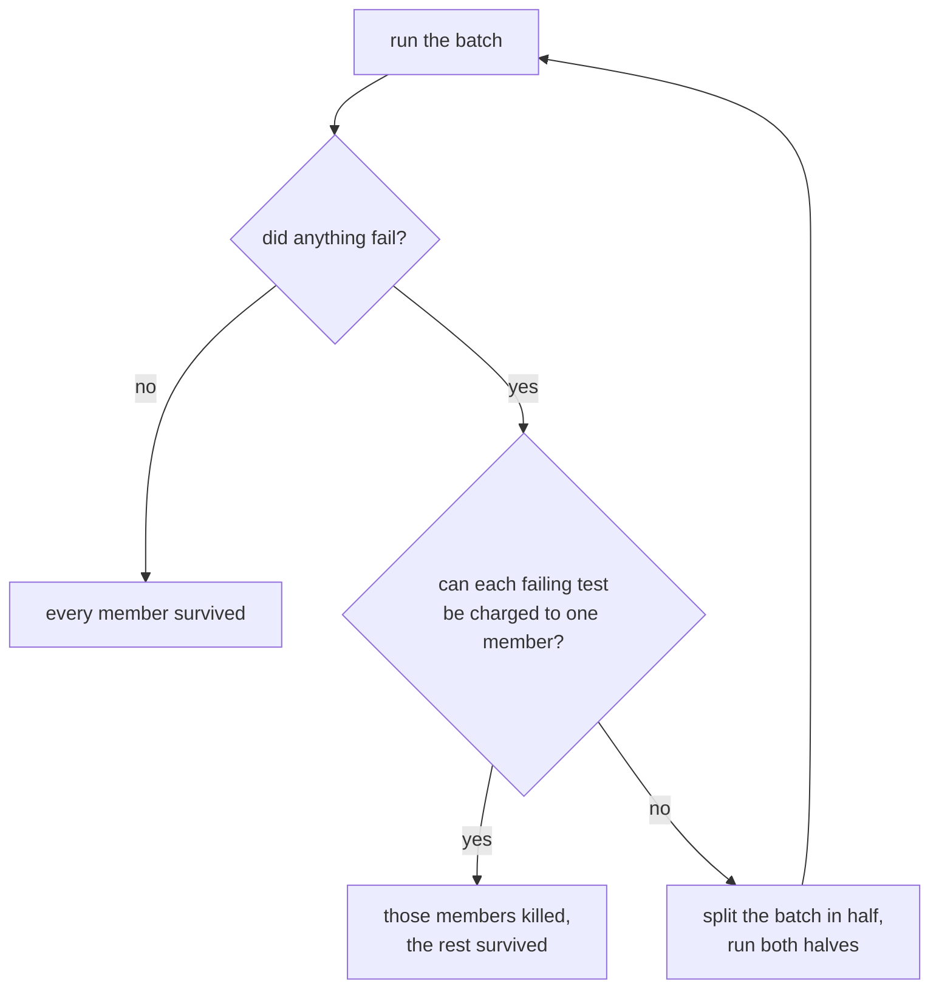

# Batch mutating

!!! abstract "In one sentence"
    Angelo plants several faults at once and judges them in a single test run, grouping
    only faults that no test can reach together. Measured at **4.6x faster** with an
    identical score.

## The problem

Mutation testing plants one fault, runs the suite, records the verdict, and repeats. The
cost is therefore the number of faults multiplied by the cost of one suite run. Five
hundred faults on a two second suite is about seventeen minutes, and most of that time is
spent starting Python rather than testing anything.

The obvious saving is to plant more than one fault per run. The obvious problem is that
you then cannot tell which fault broke which test.

## Why naive combining fails

This has been tried. Polo, Piattini and García-Rodríguez (2009) combined first order
faults into pairs, halving the number of runs. They accepted a known cost, called **fault
masking**: when two faults are active in one execution, one can hide the other, and the
verdict for at least one of them is lost.

Angelo takes a different route. Rather than tolerating masking, it arranges for masking to
be impossible.

## The insight

Masking requires a single test to execute both faults. If no test touches both, neither
can hide the other, and any failure is unambiguous.

That gives the rule:

!!! note "Definition"
    Two mutants **conflict** when the same test case executes both of them. A **batch** is
    a set of mutants that pairwise do not conflict.

Note what the rule is built on. It is not about the structure of the source code, whether
two faults sit in the same function, or the same file. It is about **the tests**, because
the tests are the thing being measured.

## Where the conflict data comes from

One coverage run, before any mutating begins. Angelo runs your suite once under
coverage.py with `dynamic_context = test_function`, which records not just which lines
ran, but which test ran them.

That produces a map from every line to the set of tests that execute it. Two mutants
conflict when those sets overlap.

The same map pays for itself three more times over. A mutant on a line no test executes
cannot be killed, so it is marked survived without ever running. A mutant executed only
at import time affects every test, so it runs alone. And the map tells Angelo which tests
to run at all, which is [test selection](02-test-selection.md).

## Judging a batch

Three cases, three rules:

1. **Nothing failed.** No test objected to any of the faults, so every member survived.
   One run, many verdicts. This is where the saving comes from.
2. **Something failed, and every failure is explainable.** Each failing test is charged to
   the single batch member that it covers. Members whose tests all passed survived.
3. **Anything else.** A timeout, a crash, or a failure that no member explains. Angelo
   refuses to guess. It splits the batch and runs both halves.

Case three is the safety net. It means a verdict only ever comes from a run that proves
it, and it is why an unexpected result costs speed rather than accuracy.

## Result

Two hundred mutants, eight workers, two second suite.

| batch size | time | score |
| --- | --- | --- |
| 1 | 48.1 s | 39.5% |
| 8 | 10.4 s | 39.5% |

**4.6x faster, identical verdicts.** One hundred and sixty one runs collapsed into
twenty one.

## Limits

- Batching needs coverage.py and a `python -m pytest` test command. Without them every batch has
  one member, and Angelo still works.
- Mutants that run at import time cannot be batched, because import time code executes
  under every test.
- Batching and [test selection](02-test-selection.md) compete for the same saving. Read
  that note before tuning `batch_size`.
- A suite with heavy shared state produces unexplainable failures, which trigger splitting
  and erode the gain.
- On the [schemata](08-schemata.md) path, two mutants of the **same function** conflict
  however disjoint their tests are. One wrapper can only call one copy.
- Raising `batch_size` past the default buys nothing on a real codebase. flask's
  1000-mutant pool composes into 409 batches at 8 and **407 at 32**: the cap never binds,
  conflict does.

!!! warning "A suite that is not order-independent"
    A batch runs the **union** of its members' tests, so a mutant is judged alongside tests
    that would not otherwise have run. On a suite that leaks state between tests, that
    changes answers. On flask, batch 8 and batch 1 disagree about **32 of 1000** mutants —
    `os.environ` reads in `cli.py` and `helpers.py`, logging configuration in `logging.py` —
    and they disagree by the same amount with schemata off, so this is batching itself and
    not the newer path. No grouping strategy fixes it; the fault is in the suite. The
    [verdict matrix](https://github.com/kvandeh/angelo/blob/main/scripts/verdict-matrix.sh)
    guarantees agreement on a suite that *is* order-independent, which is the most any tool
    can promise here.

## Related work

| Source | Relationship |
| --- | --- |
| Untch, Offutt and Harrold (1993) | Mutant schemata, the classic cost reduction |
| Polo, Piattini and García-Rodríguez (2009) | Second order mutants, and the masking problem this note avoids |
| Ma and Kim (2016) | "Overlapped mutants" means near duplicates, a different idea despite the similar name |
| mutest-rs | The same batching idea for Rust, deriving conflicts from a static call graph rather than coverage |
