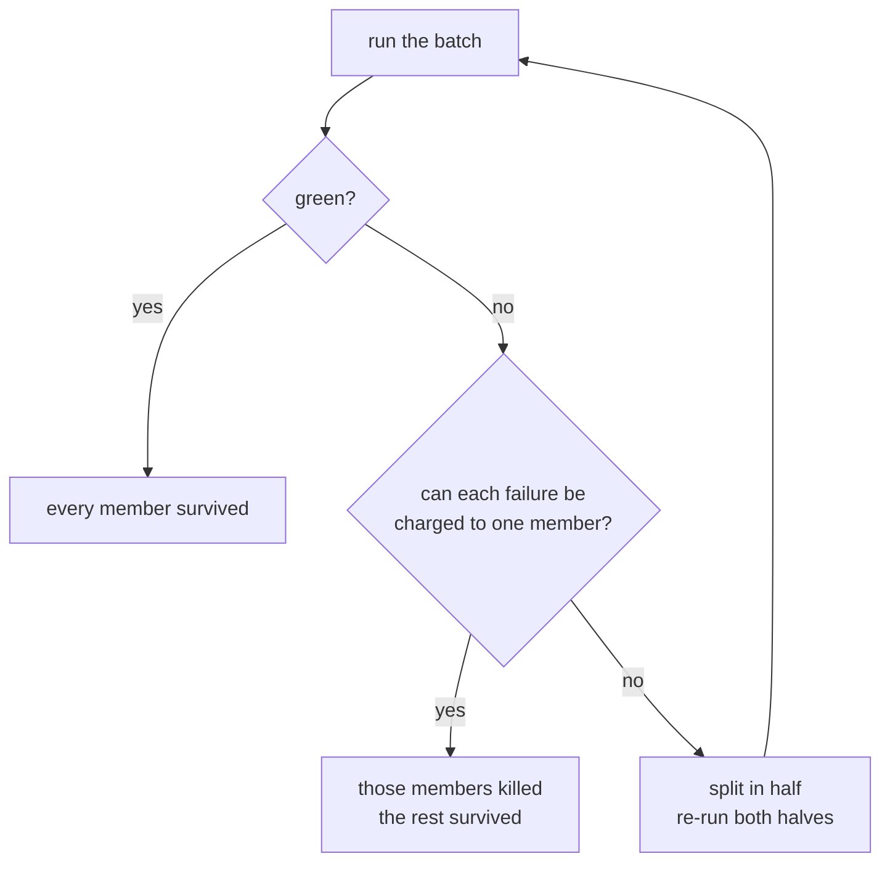

# 01 — Batch mutating

**Abstract.** Mutation testing normally runs the test suite once per mutant. angelo
applies several mutants at once and judges them in a single run. Mutants that share a
covering test are kept apart, so every failure still points at exactly one mutant.
Measured at **4.6x** with no change to the score.

## Background

One mutant, one suite run. 500 mutants, 500 runs. Each run repays Python's startup cost
before testing anything.

Prior work combined mutants blindly and accepted the error. Polo et al. (2009) paired
first-order mutants into second-order ones, halving runs at the cost of **fault masking**:
two faults in one execution can hide each other, so a verdict is lost.

angelo avoids masking instead of tolerating it.

## Method

Masking needs one test to execute both mutants. So: **two mutants conflict when the same
test case covers both.** A batch holds only mutants that share no test.

Conflicts come from one coverage.py run over the unmutated code, with
`dynamic_context = test_function` — that records which test executed which line.

Three outcomes, three rules:

- **Green** — nothing failed, so every member survived. One run, many verdicts.
- **Red and attributable** — each failed test is charged to the one member covering it.
- **Anything else** — timeout, crash, or a failure no member explains → **bisect**.

Bisection is the safety net. A verdict only ever comes from a run that proves it.

## Result

200 mutants, 8 workers, 2s suite:

| batch_size | time | score |
|---|---|---|
| 1 | 48.1s | 39.5% |
| 8 | 10.4s | 39.5% |

**4.6x, identical verdicts.** 161 runs collapsed into 21.

## Limits

- Needs coverage.py and the default pytest command. Without them, batches are size 1 and
  everything still works.
- Mutants executed only at import time affect every test, so they run alone.
- Batching and test selection compete — see [note 02](02-test-selection.md).
- A batch that goes red on a suite with heavy shared state bisects often, eating the win.

## Prior art

- Untch, Offutt & Harrold (1993) — mutant schemata.
- Polo, Piattini & García-Rodríguez (2009) — second-order mutants; the masking problem.
- Ma & Kim (2016) — "overlapped mutants" means near-duplicates, a *different* idea.
- mutest-rs — same batching idea for Rust, conflicts from a static call graph instead.
