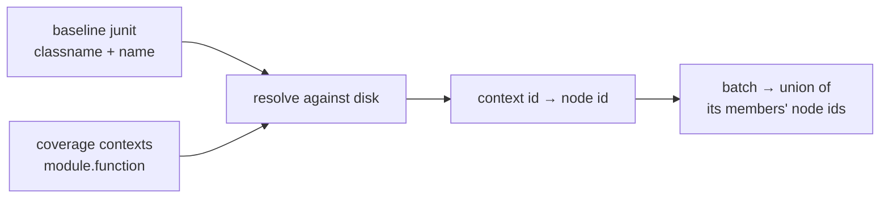
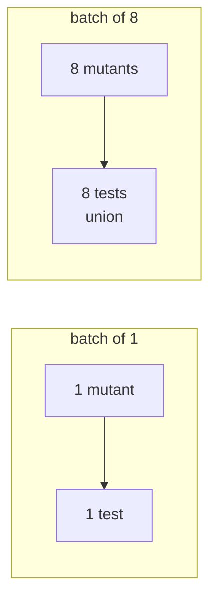

# 02 — Test selection

**Abstract.** A mutant can only be killed by a test that executes it. angelo runs those
tests and no others, using the coverage map it already builds for batching. Measured at
**2.8x** unbatched. Selection and batching partly cancel: together they give 7.7x, not
the 12.9x their product suggests.

## Background

PIT built its reputation on this ("minutes instead of days"). Stryker calls
`coverageAnalysis: 'perTest'` its single biggest speedup knob.

angelo already collected the data for conflict detection and was throwing away its other
use.

## Method

Coverage says *which test*; pytest needs *a node id*. The two spell tests differently:

```
coverage context   pkg.test_mod.test_x
pytest node id     pkg/test_mod.py::test_x
```

A dotted classname does not say where the module ends and classes begin — `a.b.c` could be
`a/b/c.py` or `a/b.py::c`. So resolution walks prefixes and takes the longest that exists
on disk.



Two rules keep it honest:

- **Anything unresolvable falls back to the whole suite.** Running too many tests is slow;
  running too few invents survivors.
- **A single-mutant run adds `-x`.** The first failure already settles it.

## Result

200 mutants, 8 workers:

| suite | batching | selection | both |
|---|---|---|---|
| 2.0s | 4.6x | **2.8x** | **7.7x** |
| 0.2s | 3.7x | 1.05x | 4.0x |

## The interaction

Selection is worth **2.8x at batch_size 1** but only **1.7x at batch_size 8**.

A batch runs the *union* of its members' tests. Bigger batch → bigger union → closer to
the whole suite. The two features compete for the same saving.



No published multiplier exists for this interaction. It is worth measuring per project,
not assuming.

## Limits

- Saves **test** time, not **startup** time. On a 0.2s suite it is worth ~5%, because
  there is no test time to save. See [note 03](03-warm-workers.md) for the other half.
- Parametrised tests collapse to their function — the selection is a safe superset.
- Needs coverage.py and the default pytest command.
