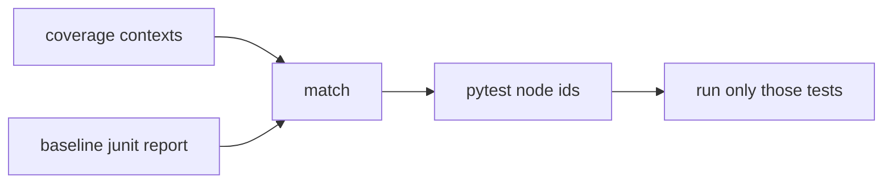
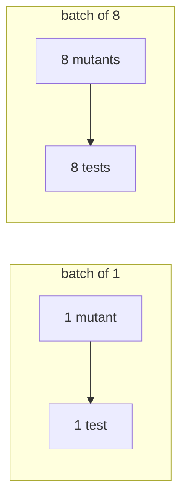

# Test selection

!!! abstract "In one sentence"
    A fault can only be caught by a test that executes it, so angelo runs those tests and
    no others. Measured at **2.8x faster** on its own, though it partly competes with
    batching.

## The problem

Planting a fault in one function and then running three thousand tests is mostly waste.
Only the handful of tests that actually execute that function can possibly notice.

This is not a new observation. PIT built its reputation on it, describing the difference
as minutes instead of days. Stryker calls per test coverage analysis its single largest
speedup setting.

angelo already collected the necessary data for [batching](01-batch-mutating.md) and was
using it for one purpose only.

## The awkward part

Coverage and pytest do not spell a test the same way.

| Source | How it names one test |
| --- | --- |
| coverage.py context | `pkg.test_mod.test_x` |
| pytest node id | `pkg/test_mod.py::test_x` |

Converting between them is not string manipulation, because a dotted name is ambiguous.
Given `a.b.c`, the module could be `a/b/c.py`, or it could be `a/b.py` containing a class
`c`. Nothing in the name says which.

angelo resolves this by walking prefixes and taking the longest one that exists as a file
on disk. The test inventory comes from the junit report of the baseline run, which lists
every test with its class name.

## Two rules that keep it honest

**Anything unresolvable falls back to running everything.** If a single covering test
cannot be named exactly, angelo runs the whole suite for that batch. Running too many
tests costs time. Running too few would invent survivors, which is the one failure this
tool must never have.

**A run judging a single mutant stops at the first failure.** Once one test has failed,
the mutant is caught, and the rest of the suite has nothing left to say. A batch never
stops early, because it needs to see every failure in order to attribute them.

## Result

Two hundred mutants, eight workers.

| suite length | batching alone | selection alone | both |
| --- | --- | --- | --- |
| 2.0 s | 4.6x | **2.8x** | **7.7x** |
| 0.2 s | 3.7x | 1.05x | 4.0x |

## The interaction worth understanding

Selection is worth 2.8x at a batch size of one, but only 1.7x at a batch size of eight.

The reason is structural. A batch runs the **union** of its members' covering tests. The
larger the batch, the larger that union, and the closer it gets to simply running
everything. The two features are competing for the same saving.

They still stack to 7.7x, which is well short of the 12.9x their product would suggest.
No published figure exists for this interaction, so the honest advice is to measure
`batch_size` on your own project rather than trusting a default.

## Limits

- Selection removes **test** time, not **startup** time. On a fast suite there is very
  little test time to remove, which is why the 0.2 second row shows almost nothing.
  [Warm workers](03-warm-workers.md) attack the other half.
- Parametrised tests collapse to their function, so the selection is a safe superset.
- Requires coverage.py and the default pytest command.
