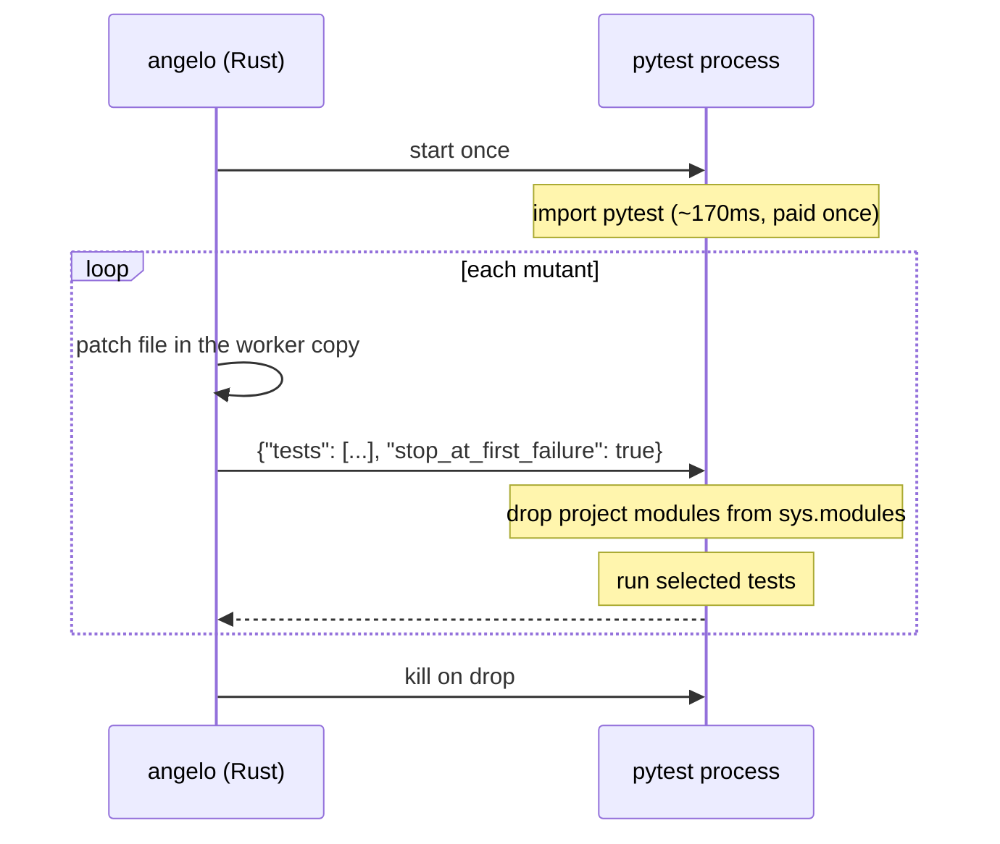

# 03 — Warm workers

**Abstract.** Once only the covering tests run, a mutant costs ~330ms of which ~315ms is
starting Python and importing pytest. Unix tools skip that with `fork()`; Windows has
none. Python 3.14 subinterpreters were measured and do **not** substitute. angelo keeps
one pytest process alive per worker instead: **2.5x**, verdicts unchanged.

## Background

Measured cost of one selected run:

| step | time |
|---|---|
| bare interpreter | 18 ms |
| + import pytest | 173 ms |
| + collect & configure | 312 ms |
| + actually run one test | **327 ms** |

**95% of a selected run is startup.** That is the wall.

`fork()` clones an already-warm interpreter in milliseconds — imports included. It is why
mutmut is fast, and why mutmut refuses to run on Windows at all.

## Rejected: subinterpreters

PEP 734 landed `concurrent.interpreters` in Python 3.14. Isolated `sys.modules`, no
`fork()` needed, works on Windows. Measured:

| step | time |
|---|---|
| create a subinterpreter | 15 ms |
| import pytest inside it | **131 ms** |
| import pytest, cold, main interpreter | 119 ms |

**No saving.** Isolation is the point: each interpreter re-executes every import. Fork's
value is inheriting imports; PEP 734 deliberately does not.

Do not revisit without new evidence.

## Method

Keep the process. Reset only what changed.

**What gets purged:** every module whose `__file__` is under the worker copy. Mutated
source is re-imported; pytest, stdlib and site-packages stay loaded.

**Why replies are prefixed:** pytest writes progress to the same stdout. The `##angelo##`
prefix is what separates protocol from chatter.

**Safety net**, matching batching's: any timeout, crash, or unparseable reply retires the
worker and the mutant re-runs in a fresh subprocess. The process also recycles every
`warm_recycle_after` runs (default 50) to bound accumulated state.

## Result

200 mutants, 8 workers:

| | warm off | warm on | |
|---|---|---|---|
| 0.2s suite, batch=1 | 9.29s | **3.77s** | 2.5x |
| 2.0s suite, batch=1 | 11.20s | **5.94s** | 1.9x |
| 2.0s suite, batch=8 | 5.12s | 4.45s | 1.15x |

Warm workers pay most where runs are many and each is cheap — the mirror of test
selection, which pays where each run is expensive.

Full stack, 2.0s suite: **48.1s → 4.5s, 10.8x**, same score throughout.

## Two bugs this cost

Both silent, both caught by tests:

1. **Purging `__main__` broke pytest.** The driver *is* `__main__` and lives in the copy;
   pdb does `import __main__`. Every mutant came back `error`.
2. **pytest's stdout collided with the protocol.** The reader parsed "1 passed" as a reply.

## Limits

- Only for `python -m pytest ...` commands. Anything else uses subprocesses.
- State can survive a purge: C-extension globals, third-party caches holding project
  objects. Recycling bounds it; it does not eliminate it.
- A hanging mutant costs a whole worker restart, not just a process kill.
- **If a score ever drifts between runs, set `warm_workers = false` first.** This is the
  same risk class as the stale-bytecode bug in [note 05](05-benchmarks.md).
