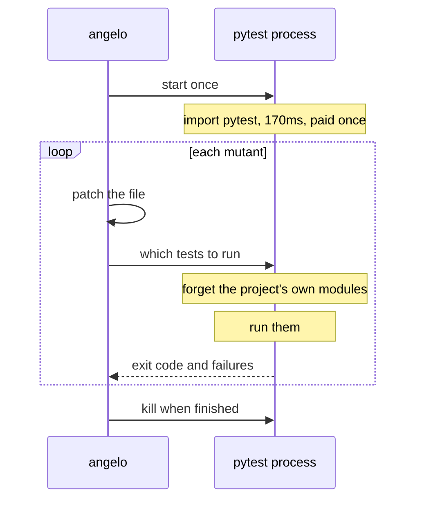

# Warm workers

!!! abstract "In one sentence"
    Once only the relevant tests run, almost all remaining time is spent starting Python.
    Unix tools avoid that with `fork()`, which Windows lacks, so Angelo keeps one pytest
    process alive instead. Measured at **2.5x faster**, verdicts unchanged.

## The problem

After [test selection](02-test-selection.md), a mutant costs about 330 milliseconds. Only
about 15 of those milliseconds are testing.

| Step | Time |
| --- | --- |
| Start the interpreter | 18 ms |
| Import pytest | 155 ms |
| Collect and configure | 139 ms |
| Run the actual test | 15 ms |
| **Total** | **327 ms** |

Roughly 95 percent of a run is setup that produces no information. No amount of smarter
scheduling helps, because the cost is paid before scheduling begins.

## How other tools avoid it

`fork()` clones a running process almost instantly, and the clone inherits everything the
parent had already imported. A mutation tester can therefore import pytest once, then fork
a fresh warm copy per mutant. Each copy starts hot and dies with its mess contained.

This is why mutmut is fast. It is also why mutmut **refuses to run on Windows at all**,
telling you to use WSL, because Windows has no `fork()`.

## A rejected alternative

Python 3.14 added `concurrent.interpreters` through PEP 734. Subinterpreters are isolated,
cheap, and work on Windows, which makes them an obvious candidate.

They were measured rather than assumed:

| Step | Time |
| --- | --- |
| Create a subinterpreter | 15 ms |
| Import pytest inside it | **131 ms** |
| Import pytest cold, main interpreter | 119 ms |

**There is no saving.** Isolation is precisely the point of a subinterpreter: each one
gets its own `sys.modules` and re-executes every import. The value of `fork()` is
inheriting imports, and PEP 734 deliberately does not do that.

This result is recorded so nobody repeats the experiment.

## What Angelo does instead

Keep the process. Reset only the part that actually changed.

Between mutants the worker deletes every module whose file lives inside the project copy.
The mutated source is therefore re-imported on the next run, while pytest, the standard
library and site-packages stay loaded. That is the entire saving.

## Keeping it safe

A long lived process accumulating state is exactly the kind of thing that produces wrong
verdicts, so three guards apply.

**Any anomaly retires the worker.** A crash, or a reply Angelo cannot parse, means the
process is killed and the mutant is re-run in a fresh subprocess. Warm running can
therefore only change the clock.

A timeout retires a **purging** worker, which is still stuck on the test that hung. It does
not retire a [forking](08-schemata.md#isolation) one: that parent never ran the test, it
killed the child's process group and carried on, so restarting it would repay a warm-up
that nothing has dirtied.

**The process recycles.** After `warm_recycle_after` runs, default 50, it is replaced.
This bounds anything that survives the module purge — and it does nothing on the fork path,
where nothing accumulates to bound.

**It only applies to plain pytest commands.** Anything else uses subprocesses.

## Result

Two hundred mutants, eight workers.

| Configuration | warm off | warm on | Gain |
| --- | --- | --- | --- |
| 0.2 s suite, batch 1 | 9.29 s | **3.77 s** | 2.5x |
| 2.0 s suite, batch 1 | 11.20 s | **5.94 s** | 1.9x |
| 2.0 s suite, batch 8 | 5.12 s | 4.45 s | 1.15x |

Warm workers pay most where runs are many and each is cheap, which is the mirror image of
test selection. Together with batching, the full stack takes a 48.1 second job down to
4.5 seconds.

## Two bugs this cost

Both were silent, and both were caught by tests rather than by reading the code.

**Purging `__main__` broke pytest.** The worker script itself is `__main__`, and it lives
inside the project copy, so the module purge deleted it. Python's debugger imports
`__main__`, so every mutant came back as an error.

**pytest's output collided with the protocol.** Both were writing to the same stdout, so
the reader parsed "1 passed" as a reply. Replies now carry a marker prefix.

## Limits

- Only for `python -m pytest` style commands.
- State can outlive a purge. C extension globals and third party caches holding project
  objects are the realistic cases. Recycling bounds this; it does not remove it.
- A hanging mutant costs a worker restart rather than just a process kill.
- **If a score ever drifts between runs, set `warm_workers = false` first.** This is the
  same risk class as the stale bytecode bug in [benchmarks](05-benchmarks.md).
