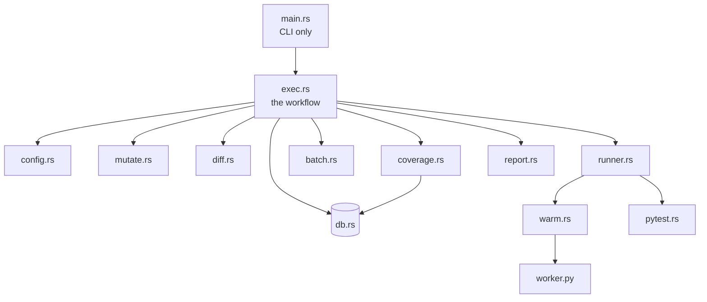
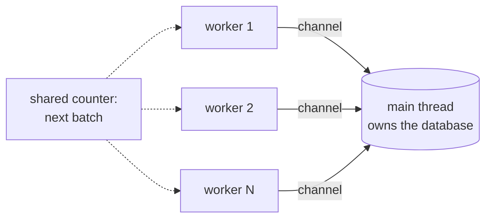

# Architecture

!!! abstract "In one sentence"
    One Rust binary, flat modules, one Python file. Types own their behaviour, async is
    confined to a single file, and anything needing cleanup cleans itself up.

Roughly 2,700 lines of Rust, about a third of which is tests, plus 79 lines of Python and
ten dependencies.

## Module map

| Module | Owns |
| --- | --- |
| `main.rs` | Command line definitions and dispatch. Nothing else. |
| `exec.rs` | The workflow: enumerate, baseline, split, compose, run, report. |
| `config.rs` | `angelo.conf`, file discovery, skip lists. |
| `mutate.rs` | `Mutant`, `Status`, the operator table, enumeration. |
| `coverage.rs` | `Coverage`: classify, attribute, select. |
| `batch.rs` | `Batch`: the conflict rule and the composer. |
| `diff.rs` | `ChangedLines`: git hunks into a line filter. |
| `pytest.rs` | The pytest process, `SuiteResult`, `Selection`, node ids. |
| `runner.rs` | Threads, project copies, patching, splitting. |
| `warm.rs` | The long lived pytest host. |
| `db.rs` | turso. **The only async file.** |
| `report.rs` | `Progress` for live output, `Summary` for scoring. |

## Three rules

### Types own their behaviour

If a function takes an `X` and branches on it, it belongs on `X`. Hence
`SuiteResult::status()`, `Batch::accepts()`, `TestCase::node_id()` rather than a pile of
free functions taking six arguments each.

### Async is quarantined

turso's API is async only. Rather than colour the whole program, `db.rs` owns a single
threaded tokio runtime and blocks on every call. Everything outside that file is ordinary
synchronous Rust.

### Cleanup is automatic

Anything that must be undone implements `Drop`, so it is undone even on an early return or
a panic.

| Type | Undoes |
| --- | --- |
| `WorkerCopy` | Deletes the temporary project copy |
| `PatchedFiles` | Restores mutated files |
| `WarmWorker` | Kills the pytest process |

`Drop` cannot return errors. `PatchedFiles` therefore swallows a failed restore on
purpose: the next batch checks the original bytes before patching, so a bad restore
becomes an `error` verdict rather than a wrong one.

## Concurrency

Scoped threads, one atomic integer as the work queue, and a channel for results. **Every
database write happens on the main thread**, so there is no locking anywhere in the
program.

Scoped threads are also what allow a worker to hold plain references rather than reference
counted pointers, because the compiler can prove the threads finish before the borrowed
data goes away.

## Data lives in data files

| File | Reason |
| --- | --- |
| `db/schema.sql` | SQL should be SQL, not a string constant |
| `runner/worker.py` | Python should be Python |

Both are embedded into the binary at compile time, so there is still only one file to
ship.

The operator table is a macro, so the lookup and the list its tests iterate are generated
from the same lines and cannot drift apart.

## Dependencies

| Group | Crates |
| --- | --- |
| Plumbing | clap, serde, toml, anyhow |
| Database | turso, tokio |
| Python parsing | ruff_python_parser, ruff_python_ast, ruff_text_size |
| junit XML | roxmltree |

Three were removed by hand rolling small replacements: `walkdir` became a twelve line
recursive copy, `tempfile` became a `Drop` implementation, and `serde_json` became a
newline joined list plus a twenty line reply parser.
