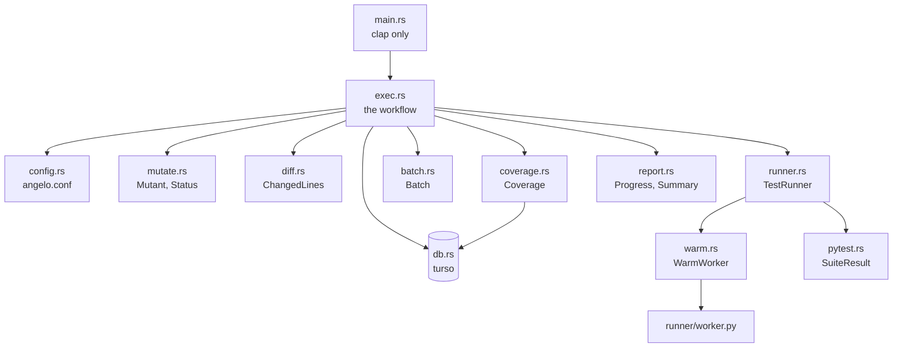
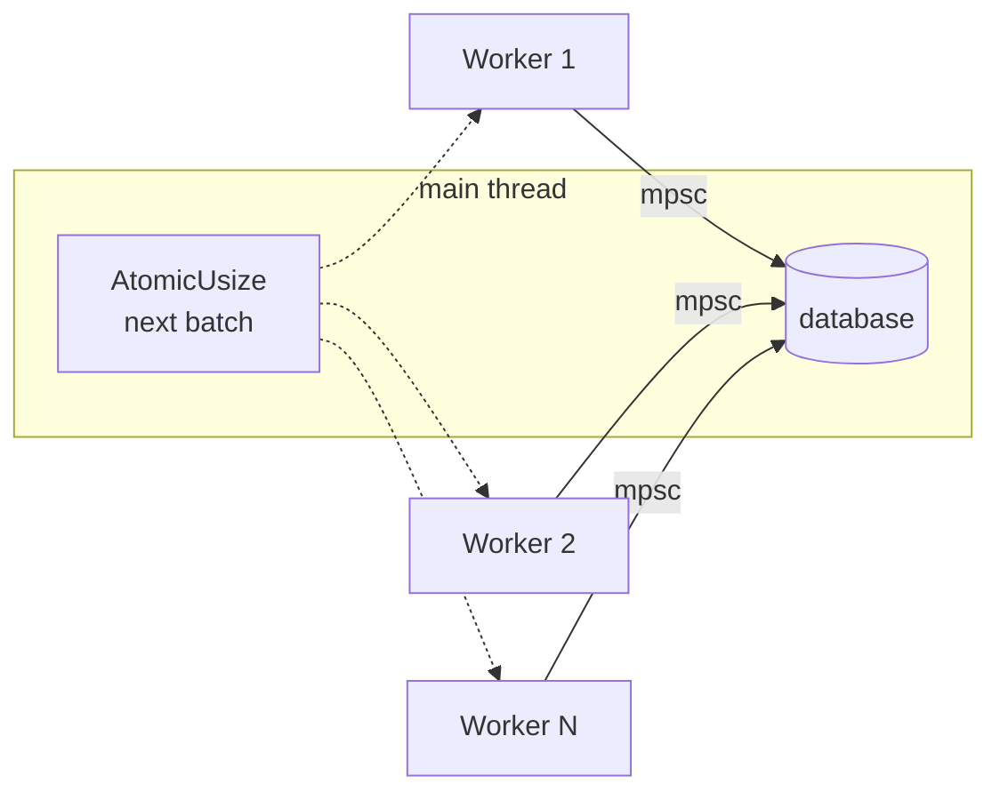

# 04 — Architecture

**Abstract.** One Rust binary, flat modules, one Python file. Types own their behaviour;
async is quarantined in one file; anything that must be cleaned up cleans itself up via
`Drop`. 2.7k lines of Rust (about a third of it tests), 79 lines of Python,
10 dependencies.

## Module map

| Module | Owns |
|---|---|
| `main.rs` | CLI definitions and dispatch. Nothing else. |
| `exec.rs` | The workflow: enumerate → baseline → split → compose → run → report. |
| `config.rs` | `angelo.conf`, file discovery, skip lists. |
| `mutate.rs` | `Mutant`, `Status`, the operator table, enumeration. |
| `coverage.rs` | `Coverage`: classify, attribute, select. |
| `batch.rs` | `Batch`: conflict rule, first-fit composer. |
| `diff.rs` | `ChangedLines`: git hunks → a line filter. |
| `pytest.rs` | The pytest process, `SuiteResult`, `Selection`, node ids. |
| `runner.rs` | Threads, project copies, patching, bisection. |
| `warm.rs` | The long-lived pytest host. |
| `db.rs` | turso. **The only async file.** |
| `report.rs` | `Progress` (live), `Summary` (scoring). |

## Three rules

**1. Types own their behaviour.** If a function takes an `X` and branches on it, it
belongs on `X`. `SuiteResult::status()`, `Batch::accepts()`, `TestCase::node_id()`.

**2. Async is quarantined.** turso's API is async-only. `db.rs` owns a current-thread
tokio runtime and `block_on`s every call. Everything else is plain sync Rust.

**3. Cleanup is automatic.** Anything that must be undone implements `Drop`:

| Type | Undoes |
|---|---|
| `WorkerCopy` | Deletes the temp project copy |
| `PatchedFiles` | Restores mutated files |
| `WarmWorker` | Kills the pytest process |

`Drop` cannot return errors. `PatchedFiles` swallows a failed restore on purpose — the
next batch's original-bytes check turns it into an `error` verdict rather than a wrong one.

## Concurrency

`std::thread::scope` + one `AtomicUsize` as the work queue + `mpsc` for results. **The
main thread owns every database write**, so no locking anywhere.

`thread::scope` is what lets `Worker<'a>` hold plain references instead of `Arc` — the
compiler proves the threads end before the borrowed data does.

## Data, not string blobs

| File | Why |
|---|---|
| `db/schema.sql` | SQL is SQL. `include_str!`ed. |
| `runner/worker.py` | Python is Python. `include_str!`ed, written into the copy. |

The operator table in `mutate.rs` is a `macro_rules!` so the lookup and its test list are
generated from the same lines and cannot drift.

## Dependencies (10)

| Group | Crates |
|---|---|
| Plumbing | clap, serde, toml, anyhow |
| Database | turso, tokio |
| Python parsing | ruff_python_parser, ruff_python_ast, ruff_text_size |
| junit XML | roxmltree |

Largest modules: `runner.rs` (443), `coverage.rs` (414), `pytest.rs` (327). Every module
carries its own `#[cfg(test)] mod tests`; `tests/end_to_end.rs` drives the real binary.

Cut by hand-rolling: `walkdir` (12-line recursive copy), `tempfile` (a `Drop` impl),
`serde_json` (newline-joined lists, and a 20-line reply parser).
