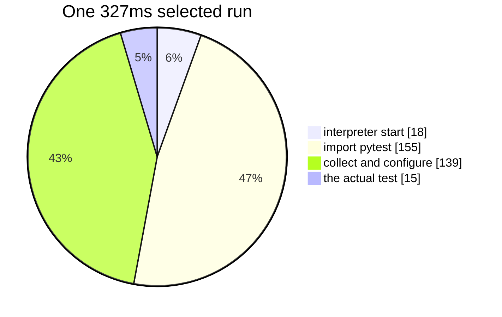

# Benchmarks

!!! abstract "In one sentence"
    Stacked, angelo's optimisations take a 48 second job down to 4.5 seconds with
    unchanged verdicts. This note records the measurements, the comparison against mutmut,
    and one bug that made an earlier set of numbers false.

## Method

- **Machine.** WSL Ubuntu on Windows 11, 16 cores, Python 3.14.
- **Synthetic project.** Forty independent functions, one test each, 200 mutants. A
  `conftest.py` sleep sets the suite length, so the same mutant pool can be measured
  against a fast suite and a slow one.
- **Control.** The score. Every configuration must produce the same one.
- Single runs, not averages. Treat any difference under about 10 percent as noise.

## The feature matrix

Two hundred mutants, eight workers.

| Suite | Batch | Selection | Warm | Time | Score |
| --- | --- | --- | --- | --- | --- |
| 0.2 s | 1 | off | off | 15.88 s | 39.5% |
| 0.2 s | 8 | on | off | 3.99 s | 39.5% |
| 0.2 s | 8 | on | on | **2.16 s** | 39.5% |
| 2.0 s | 1 | off | off | 48.13 s | 39.5% |
| 2.0 s | 8 | on | off | 6.22 s | 39.5% |
| 2.0 s | 8 | on | on | **4.45 s** | 39.5% |

**10.8x on the slow suite, 7.4x on the fast one.** The score never moved.

## Where a run's time goes

One selected single test run, measured by isolating each step:



About 95 percent is overhead. This is why [warm workers](03-warm-workers.md) exist, and
why [test selection](02-test-selection.md) alone reaches a ceiling.

## Which feature pays when

| Feature | Fast suite | Slow suite |
| --- | --- | --- |
| Batching | 3.7x | 4.6x |
| Test selection | 1.05x | 2.8x |
| Warm workers | 2.5x | 1.9x |

The rule of thumb: **selection removes test time, warm workers remove startup time.** A
project with a slow suite wants the first. A project with many cheap tests wants the
second. Batching helps both, though it partly competes with selection.

## Comparison against mutmut

Same machine, same project, both at eight workers.

| Tool | Mutants | Wall time | Per mutant |
| --- | --- | --- | --- |
| angelo, batch 16 | 200 | 2.5 s | 0.0125 s |
| mutmut 3.6.0 | 360 | 3.7 s | **0.0103 s** |

**mutmut is about 1.2x cheaper per mutant.** It uses schemata plus `fork()`; angelo comes
close with neither. The operator sets differ, so per mutant cost is the only fair column.

mutmut **cannot run on Windows at all**, because it requires `fork()`.

## The bug that made earlier numbers false

Four configurations that must agree reported **77, 73, 69 and 78** kills.

A `.pyc` file is reused when the source's recorded modification time in whole seconds and
its byte size both still match. Same size replacements, such as `+` becoming `-`, written
in the same second as the previous one, therefore ran the **old bytecode**. The mutant
survived for free.

- Invisible on Windows, where a 1.9 second suite pushes writes into different seconds.
- Obvious on Linux, where a 0.2 second suite lands many runs inside one second.
- Fixed by never writing bytecode. Note that the environment variable alone is **not**
  sufficient if a `.pyc` already exists, because Python still reads it.

The lesson is worth stating plainly: a mutation tester's characteristic failure is
inventing test gaps that do not exist. The verdict matrix in continuous integration exists
because of this bug.

## What these numbers do not prove

- The synthetic project has **independent functions with disjoint tests**, which is the
  best possible case for batching. Real code shares tests, so expect less.
- Single runs on one machine, with no confidence intervals.
- Windows process spawning is far slower than Linux. Only compare within a platform.
- A tool that dies instantly on every mutant looks fast and scores zero. **Check the
  error count before trusting any score.**

## Reproducing

```bash
bash scripts/verdict-matrix.sh          # the correctness gate, runs in CI
bash scripts/setup-extra.sh             # a virtualenv per repository in extra/
bash scripts/bench-repo.sh extra/click  # the feature matrix on a real project
```

`extra/` holds gitignored shallow clones of click, flask, httpx, requests, fastapi and
django.

**Each needs its own virtualenv.** Real projects pin pytest plugins in `pyproject.toml`.
Run them against a global Python and pytest exits 3, an internal error, before collecting
anything. angelo then refuses to start, correctly, but the fix is dependencies rather than
angelo.

**django is cloned but angelo cannot mutate it**, because it uses its own test runner
rather than pytest.
