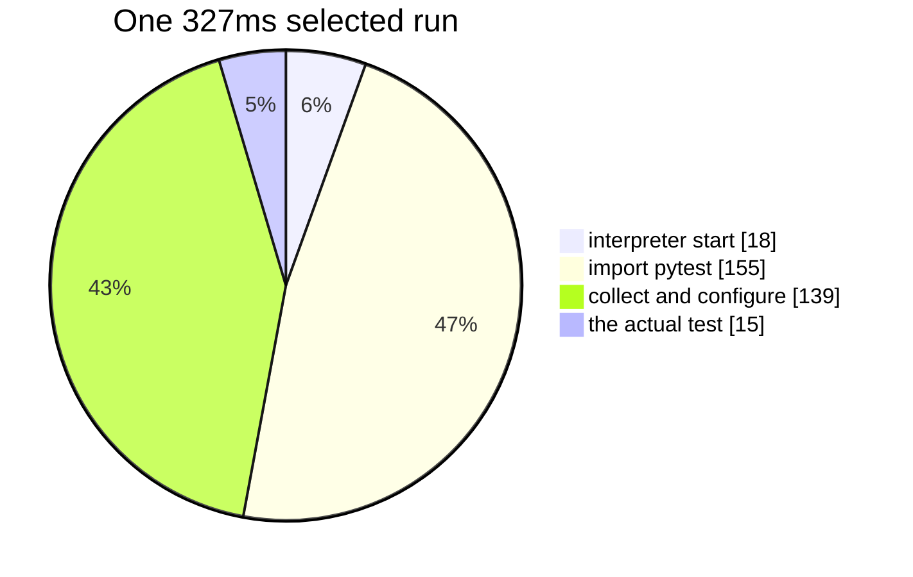
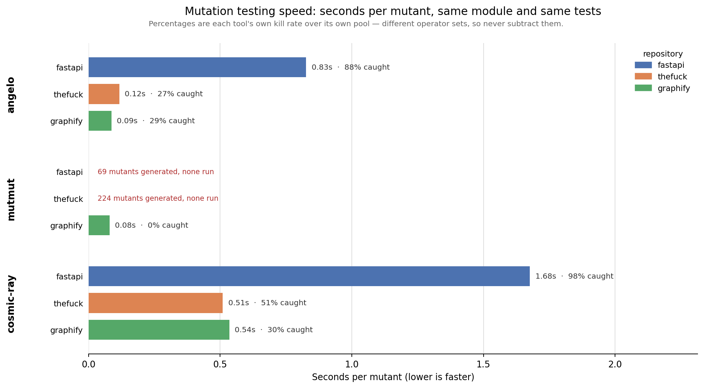

# Benchmarks

!!! abstract "In one sentence"
    Stacked, Angelo's optimisations take a 48 second job down to 4.5 seconds with
    unchanged verdicts. This note records the measurements, the comparison against mutmut,
    one bug that made an earlier set of numbers false, and one optimisation that worked
    and bought nothing.

## Method

- **Machine.** WSL Ubuntu on Windows 11, 16 cores, Python 3.14.
- **Synthetic project.** Forty independent functions, one test each, 200 mutants. A
  `conftest.py` sleep sets the suite length, so the same mutant pool can be measured
  against a fast suite and a slow one.
- **Control.** The score. Every configuration must produce the same one.
- Single runs, not averages. Treat any difference under about 10 percent as noise.

## The feature matrix

Two hundred mutants, eight workers.

| Suite | Batch | Selection | Warm | Time | Score |
| --- | --- | --- | --- | --- | --- |
| 0.2 s | 1 | off | off | 15.88 s | 39.5% |
| 0.2 s | 8 | on | off | 3.99 s | 39.5% |
| 0.2 s | 8 | on | on | **2.16 s** | 39.5% |
| 2.0 s | 1 | off | off | 48.13 s | 39.5% |
| 2.0 s | 8 | on | off | 6.22 s | 39.5% |
| 2.0 s | 8 | on | on | **4.45 s** | 39.5% |

**10.8x on the slow suite, 7.4x on the fast one.** The score never moved.

## Where a run's time goes

One selected single test run, measured by isolating each step:



About 95 percent is overhead. This is why [warm workers](03-warm-workers.md) exist, and
why [test selection](02-test-selection.md) alone reaches a ceiling.

## Which feature pays when

| Feature | Fast suite | Slow suite |
| --- | --- | --- |
| Batching | 3.7x | 4.6x |
| Test selection | 1.05x | 2.8x |
| Warm workers | 2.5x | 1.9x |

The rule of thumb: **selection removes test time, warm workers remove startup time.** A
project with a slow suite wants the first. A project with many cheap tests wants the
second. Batching helps both, though it partly competes with selection.

## A real codebase, where the numbers do not hold

The synthetic result does not survive contact with click. 957 mutants, a 4.21 second
suite, eight workers.

| Batch | Selection | Warm | Time | Per mutant | Detected | Survived |
| --- | --- | --- | --- | --- | --- | --- |
| 1 | off | off | 1119 s | 1.170 s | 540 | 336 |
| 1 | on | off | 1189 s | 1.242 s | 540 | 336 |
| 8 | on | off | 1130 s | 1.181 s | 541 | 335 |

**The optimisations bought essentially nothing, and test selection was slightly slower
than no selection at all.** Every configuration lands near 1.2 seconds per mutant.

The likely cause is visible in the verdicts. Between 60 and 76 mutants **time out** on
every run. A timeout costs the full timeout budget, here about 22 seconds, and no amount
of batching or test selection shortens it. On click, waiting for timeouts dominates
everything the optimisations save.

The synthetic project has no timeouts at all, which is precisely why it showed 10.8x.

!!! note "The budget was the bug, and it has changed"
    Those 22 seconds came from the **whole suite's** duration, charged to every mutant,
    including the ones whose selected tests are worth 50 milliseconds. A run is now
    budgeted from [the tests it actually runs](02-test-selection.md#the-budget-follows-the-selection).
    **These three rows predate that change and have not been re-measured.** The claim
    still under test is that batching and selection start paying on a repository where
    they previously did not; until click is re-run on the same machine, treat the table
    above as the last honest measurement rather than the current one.

!!! warning "Read the synthetic numbers as an upper bound"
    Independent functions, disjoint tests, and no timeouts is the best case for every
    technique in this tool. A real project with slow or hanging mutants can see no
    speedup whatsoever.

### Verdicts moved slightly, and why that is not the batching bug

The three rows disagree: 540, 540 and 541 detected; 336, 336 and 335 survived.

This is **timeout classification**, not misattribution. A mutant sitting near the timeout
threshold is detected on a loaded machine and survives on an idle one, because
`timeout_factor` is a wall clock budget. The kill and timeout columns also trade against
each other between runs for the same reason.

The [verdict matrix](https://github.com/kvandeh/angelo/blob/main/scripts/verdict-matrix.sh)
that runs in continuous integration used a fixture with no timeouts, so it could not catch
this class of variation at all. That gap is now closed: the fixture contains one mutant
that deliberately spins forever, and all eight configurations must agree that it timed
out. A budget derived from the selected tests differs per configuration, which is exactly
the disagreement the matrix exists to catch.

### An invalid fourth row

A fourth configuration was measured, but the operator set was expanded while the
benchmark was running, so it planted 4596 mutants instead of 957. It is excluded here
rather than reported, because it compares two different tools.

### flask

Skipped, and no longer for the reason given here before. Its suite is not green on this
machine out of the box, which used to stop Angelo outright. A
[red baseline now warns](quick-start.md#a-red-baseline-warns-rather-than-stops) and the
mutants those tests cover come back `untestable`, so flask is measurable — it simply has
not been measured yet.

## Against mutmut and cosmic-ray

WSL Ubuntu, 16 cores, Python 3.12, twelve workers. Each tool mutates **one module** and
runs **the same tests**, in the repository's own virtualenv, so the job is identical.
Produced by `scripts/benchmark.py`.

**Per-mutant seconds is the only column compared.** The operator sets differ, so the pools
differ, so wall time compares two different jobs. The scores are each tool's own kill rate
over its own pool and are printed side by side, never subtracted.

| Repository | Module | Angelo | mutmut | cosmic-ray |
| --- | --- | ---: | ---: | ---: |
| fastapi | `fastapi/security/api_key.py` | **0.827 s** | did not run | 1.677 s |
| thefuck | `thefuck/types.py` | **0.117 s** | did not run | 0.510 s |
| graphify | `graphify/cluster.py` | **0.087 s** | 0.080 s | 0.535 s |

**Angelo is 2.0x to 4.4x faster per mutant than cosmic-ray**, and level with mutmut on the
one repository where mutmut runs at all.



### What the other two did

**cosmic-ray runs serially.** `worker-count = 12` under its `local` distributor produced
one pytest process at a time throughout. That is most of the gap above, and it means the
column measures cosmic-ray's default rather than its ceiling. Its fastapi row is a
**timeout**: 179 of 183 mutants inside a 300 second budget, counted from its own session
database rather than dropped.

**mutmut ran on one repository of three.** On fastapi and thefuck it generates its mutants
and then stops on its own sanity check — `Unable to force test failures` — without running
any of them. A control run on **markupsafe** finishes 314 mutants in 5.9 s, so this is
mutmut meeting these repositories rather than the harness misconfiguring it. Both are
recorded rather than omitted: **a tool that produces no verdicts must not look fast.**

### What this does not prove

- One module per repository, not a whole codebase. A different module moves every number.
- Single runs. `benchmark.py --repeats 3 --warmup` gives a median and was not used here.
- mutmut's graphify score is 0.4% against Angelo's 29.0% on the same module. That is two
  different pools, not a quality comparison, and it is exactly why the rule above exists.

## The allocation pass

Angelo's own Rust had never been read for allocation. Four patterns were fixed: a line
counter that rescanned a file from byte zero once per mutant, a `String` clone per covered
line while building the coverage map, a cloned `HashSet` on every classification, and a
full copy of the file per spliced batch member. No dependency was added and no mutant
changed.

Measured on a shallow clone of django, 523,660 lines across 2,927 files, from which Angelo
enumerates **89,303 mutants across 908 files**. Windows 11, release build, three runs each.
Enumeration is isolated with `exec --diff` on a clean tree, which parses and enumerates
everything and then inserts nothing.

| Phase | Before | After |
| --- | --- | --- |
| Enumeration alone | 1.63 s | **1.26 s** |
| Enumeration plus the database insert | 150.4 s | 147.3 s |

**Enumeration got 1.3x faster, and it did not matter.** Writing 89,303 rows costs about
148 seconds, so the 0.37 seconds saved is a quarter of one percent of the command a user
actually runs. On the demo project, which enumerates thirty mutants, it is unmeasurable.

That is the honest result, and it points at the next thing rather than this one: the row
insert is what makes `angelo exec` slow to start on a large codebase, and it was left
alone here, because this was an allocation pass and one row at a time is a different
problem.

The other two fixes sit on the run path rather than on enumeration, where each saving is
buried under a pytest process that costs 300 milliseconds. Nothing was expected there and
nothing was measured; what they had to prove is that they change no verdict, which is what
the [verdict matrix](https://github.com/kvandeh/angelo/blob/main/scripts/verdict-matrix.sh)
is for.

!!! note "Two suggestions that do not apply, recorded so they stop coming back"
    **rayon.** `TestRunner::run_all` already fans out across cores with `std::thread::scope`
    and an atomic work index, and the work is a subprocess rather than arithmetic. A
    dependency that duplicates the standard library is a cost with no return.

    **`swap_remove`.** The famous one, and there is no order-preserving `Vec::remove`
    anywhere in the codebase to apply it to.

## Comparison against mutmut

Same machine, same project, both at eight workers.

| Tool | Mutants | Wall time | Per mutant |
| --- | --- | --- | --- |
| Angelo, batch 16 | 200 | 2.5 s | 0.0125 s |
| mutmut 3.6.0 | 360 | 3.7 s | **0.0103 s** |

**mutmut is about 1.2x cheaper per mutant.** It uses schemata plus `fork()`; Angelo comes
close with neither. The operator sets differ, so per mutant cost is the only fair column.

mutmut **cannot run on Windows at all**, because it requires `fork()`.

## The bug that made earlier numbers false

Four configurations that must agree reported **77, 73, 69 and 78** kills.

A `.pyc` file is reused when the source's recorded modification time in whole seconds and
its byte size both still match. Same size replacements, such as `+` becoming `-`, written
in the same second as the previous one, therefore ran the **old bytecode**. The mutant
survived for free.

- Invisible on Windows, where a 1.9 second suite pushes writes into different seconds.
- Obvious on Linux, where a 0.2 second suite lands many runs inside one second.
- Fixed by never writing bytecode. Note that the environment variable alone is **not**
  sufficient if a `.pyc` already exists, because Python still reads it.

The lesson is worth stating plainly: a mutation tester's characteristic failure is
inventing test gaps that do not exist. The verdict matrix in continuous integration exists
because of this bug.

## What these numbers do not prove

- The synthetic project has **independent functions with disjoint tests**, which is the
  best possible case for batching. Real code shares tests, so expect less.
- Single runs on one machine, with no confidence intervals.
- Windows process spawning is far slower than Linux. Only compare within a platform.
- A tool that dies instantly on every mutant looks fast and scores zero. **Check the
  error count before trusting any score.**

## Reproducing

```bash
bash scripts/verdict-matrix.sh          # the correctness gate, runs in CI
bash scripts/setup-extra.sh             # a virtualenv per repository in extra/
bash scripts/bench-repo.sh extra/click  # the feature matrix on a real project

pip install -r scripts/requirements-bench.txt
python scripts/benchmark.py --root extra --angelo target/release/angelo
```

`scripts/benchmark.py` is the three-tool comparison: it writes `bench-results.md`,
`bench-results.json` and `bench-results.png` in one command.

```bash
python scripts/benchmark.py --tools angelo,cosmic-ray   # skip a tool
python scripts/benchmark.py --repeats 3 --warmup        # median of three
```

**mutmut needs `fork()`, so that script is Linux and macOS only.** On Windows it exits
rather than print half a table.

`extra/` holds gitignored shallow clones of click, flask, httpx, requests, fastapi and
django.

**Each needs its own virtualenv.** Real projects pin pytest plugins in `pyproject.toml`.
Run them against a global Python and pytest exits 3, an internal error, before collecting
anything. Angelo then refuses to start, correctly, but the fix is dependencies rather than
Angelo.

**django is cloned but Angelo cannot mutate it**, because it uses its own test runner
rather than pytest.
