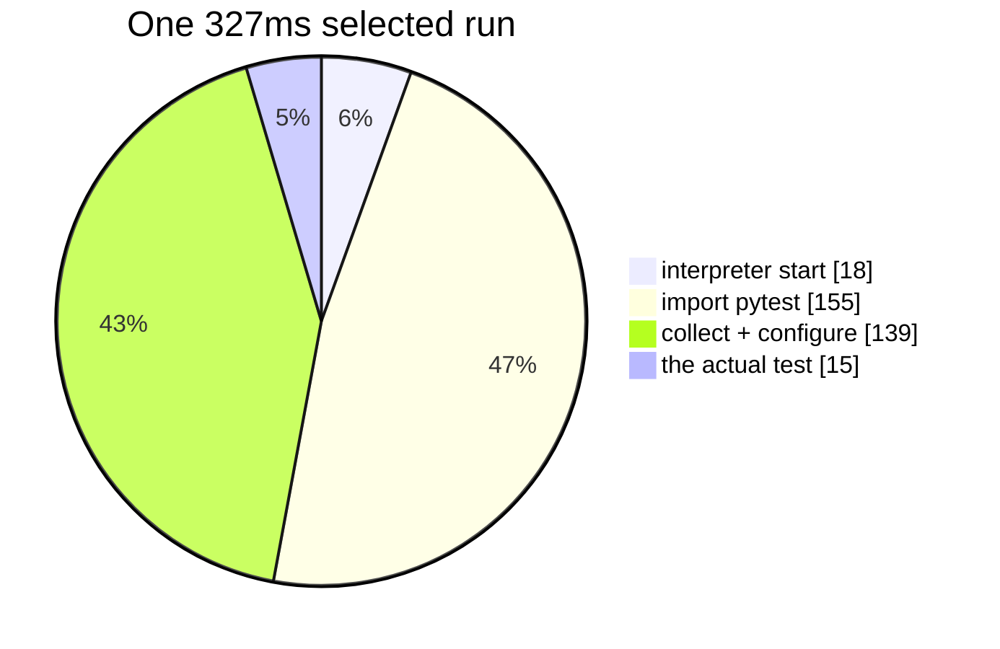

# 05 — Benchmarks

**Abstract.** angelo's optimisations were measured on a synthetic 200-mutant project and
on real repositories in `extra/`. Stacked, they give **10.8x** with unchanged verdicts.
This note also records what the numbers do *not* prove, and one bug that made earlier
numbers lies.

## Method

- **Machine:** WSL Ubuntu on Windows 11, 16 cores, Python 3.14.
- **Synthetic project:** 40 independent functions, one test each, 200 mutants. A
  `conftest.py` sleep sets the suite length, so the same mutant pool can be measured
  against a fast and a slow suite.
- **Control:** the score. Every configuration must produce the same one.
- Numbers are single runs, not averages. Treat differences under ~10% as noise.

## Result: the feature matrix

200 mutants, 8 workers.

| suite | batch | selection | warm | time | score |
|---|---|---|---|---|---|
| 0.2s | 1 | off | off | 15.88s | 39.5% |
| 0.2s | 8 | on | off | 3.99s | 39.5% |
| 0.2s | 8 | on | **on** | **2.16s** | 39.5% |
| 2.0s | 1 | off | off | 48.13s | 39.5% |
| 2.0s | 8 | on | off | 6.22s | 39.5% |
| 2.0s | 8 | on | **on** | **4.45s** | 39.5% |

**10.8x on the slow suite, 7.4x on the fast one.** Verdicts never moved.

## Result: where a run's time goes

One selected single-test run, measured by isolating each step:



**95% overhead.** This is why warm workers exist, and why test selection alone plateaus.

## Which feature pays when

| | fast suite | slow suite |
|---|---|---|
| Batching | 3.7x | 4.6x |
| Test selection | 1.05x | 2.8x |
| Warm workers | 2.5x | 1.9x |

Read it as a rule: **selection removes test time, warm workers remove startup time.**
Projects with slow suites want the first; projects with many cheap tests want the second.
Batching helps both, and partly competes with selection (see [note 02](02-test-selection.md)).

## Comparison: mutmut

Same box, same project, both at 8 workers.

| | mutants | wall | per mutant |
|---|---|---|---|
| angelo (batch=16) | 200 | 2.5s | 0.0125s |
| mutmut 3.6.0 | 360 | 3.7s | **0.0103s** |

**mutmut is ~1.2x cheaper per mutant.** It uses schemata plus `fork()`; angelo is close
without either. Operator sets differ, so per-mutant cost is the only fair column.

mutmut **cannot run on Windows at all** — it requires `fork()` and tells you to use WSL.

## The bug that made earlier numbers lies

Four configurations that must agree reported **77 / 73 / 69 / 78** killed.

A `.pyc` is reused when the source's `(mtime_seconds, size)` still match. Same-size
splices — `+`→`-`, `*`→`/` — written in the same second as the previous one ran the **old
bytecode**, so the mutant survived for free.

- Invisible on Windows: a 1.9s suite pushes writes into different seconds.
- Obvious on Linux: a 0.2s suite lands many runs inside one second.
- Fixed with `PYTHONDONTWRITEBYTECODE=1`. Note that flag alone is **not** enough if a
  `.pyc` already exists — Python still reads it.

**Lesson:** a mutation tester's failure mode is inventing test gaps that do not exist.
The verdict matrix in CI exists because of this.

## What these numbers do not prove

- The synthetic project has **independent functions with disjoint tests** — the best case
  for batching. Real code shares tests, so expect less.
- Single runs on one machine. No confidence intervals.
- Windows process spawn is far slower than Linux; only compare within a platform.
- A tool that dies instantly on every mutant looks fast and scores 0. **Check the `error`
  count before trusting any score.**

## Reproducing

```
bash scripts/verdict-matrix.sh          # correctness gate, runs in CI
bash scripts/setup-extra.sh             # a venv per repo in extra/
bash scripts/bench-repo.sh extra/click  # feature matrix on a real project
```

`extra/` holds gitignored shallow clones of click, flask, httpx, requests, fastapi and
django.

**Each needs its own venv.** Real projects pin pytest plugins in `pyproject.toml`; run
them against a global Python and pytest exits 3 (internal error) before collecting
anything. angelo then refuses to start — correctly, but the fix is dependencies, not
angelo. `setup-extra.sh` does this and reports which repos collect cleanly.

**django is cloned but not mutable by angelo**: it uses its own `runtests.py`, not pytest.
It would need pytest-django and a settings module first.
