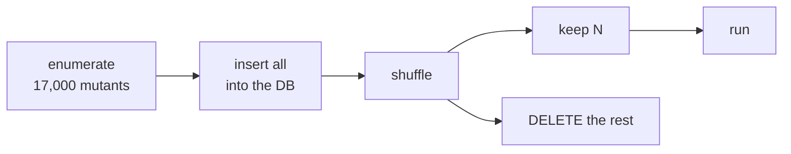

# Operators and sampling

**Abstract.** Angelo's operator set is chosen from the empirical literature rather than
from what a token stream happens to make easy. Three families are supported by every
yardstick that has been applied to them — **statement deletion**, **relational
replacement**, and **conditional and logical replacement** — and three canonical ones are
supported by none. Deletion and condition replacement are new and need the syntax tree;
unary insertion and constant replacement are now **off by default**. The larger lever is
not which operator runs but **where** it runs: `arid` suppresses call sites whose mutants
are known to be unproductive, and `per_line_cap` bounds how many mutants one line may
contribute. `--sample N` bounds the pool globally by **deleting rows**, which makes the
score an estimate over a random draw.

## Background: the yardsticks disagree, and that is the point

Thirty years of work on operator selection looks contradictory. One line concludes five
operators suffice, another twenty-eight, another that statement deletion alone competes
with all of them, and another that operator selection is no better than picking mutants at
random. These are answers to **different questions**:

| Yardstick | Asks |
|---|---|
| Sufficiency | Does a subset produce tests that kill what the full set would? |
| Coupling to real faults | Do an operator's mutants stand in for faults developers actually fixed? |
| Equivalent and stubborn yield | How many mutants are semantically identical to the original — pure cost? |
| Developer-judged productivity | Shown a survivor, does the engineer who wrote the code think it worth a test? |

Only the last exists at industrial scale, and only the second measures what mutants are
for. Read together they support a reasonably clear ranking, which is what Angelo's default
set is.

## Method: the tiers, and what Angelo does with each

| Tier | Family | Angelo |
|---|---|---|
| **Always enable** | Statement and block deletion | `BlockStatement`, on |
| | Relational replacement | `EqualityOperator`, on, two replacements per ordering operator |
| | Conditional and logical replacement | `ConditionalExpression` and `LogicalOperator`, on |
| **Enable, deduplicated** | Arithmetic replacement | `ArithmeticOperator`, `AssignmentOperator`, `BitwiseOperator`, on |
| **Only on local evidence** | Unary insertion | `UnaryOperator`, **off** |
| | Constant and literal replacement | `NumberLiteral`, `StringLiteral`, **off** |
| **Exclude** | Type, declaration and modifier level | never implemented |

The bottom row is not a Python-specific caution. A statically typed language catches those
mutants at compile time, so the waste is bounded; a dynamically typed one discovers them at
execution, and Python already has the lowest developer-judged mutant productivity of the
languages measured at scale — **70.6 percent, against 87.2 for Java**. That is also why a
type-invalid mutant lands in `error` and sits **outside** the score.

### Statement deletion

The best cost-effectiveness evidence in the literature, and absent from the canonical
five-operator set. It reaches a mutation score close to that set's while generating roughly
**80 percent fewer mutants**, it is among the families most often coupled to real faults,
and even the strongest published attack on selective mutation finds it **closer to the
Pareto front** of score against work than the canonical five.

A statement is replaced by `pass`, so a block that loses its only statement is still a
block:

```python
def total(items):
    running = 0
    for item in items:
        running += item.price      # -> pass
    return running                 # -> pass
```

A whole block goes as readily as one statement, so the `for` above is also deleted entire.

Deletion is what most directly exposes the failure coverage cannot see: **a line that runs
and that nothing asserts on**. Detecting a deletion mutant needs an assertion, not merely
execution.

What is never deleted, because the mutant is either free to detect or impossible to detect:

- **imports and definitions** — every use of the name goes with them, so any test that
  touches the module kills the mutant on sight and teaches nothing;
- **a bare `return`** — the function already returns `None` without it, so removing it is an
  equivalent mutant by construction;
- **docstrings, `...` stubs and bare literals** — the same case.

### Condition replacement

```python
if user.is_admin and not expired:   # -> if True:   /   if False:
while pending:                      # -> while False:
```

Only the tree knows where a condition starts and stops, so this is the other operator a
token stream cannot express. A `while` gets **`False` only**: `while True` on a loop that
used to end never ends, and since a timeout counts as detected, that mutant would spend the
entire budget to report what `False` reports in milliseconds.

A condition that is already a constant is left alone — a deliberate `while True:` is not a
fault waiting to be found.

### Relational replacement, twice over

Relational replacement is the only operator that scores well on **every** yardstick applied
to it: it is in the classical sufficient set, it is among the families most coupled to real
faults, its graded coupling median is double the all-operator median, and it has the
highest developer-judged productivity of the five operators deployed at Google — **84.1
percent**.

Of the seven mutants a relational clause admits, three subsume the other four, so
generating all seven is waste. Angelo used to generate **one**, which is under that mark
rather than over it: only the negation was planted, and nothing landed on the boundary
where off-by-one faults live. Each ordering operator now takes two.

| Original | Boundary | Negation |
|---|---|---|
| `<` | `<=` | `>=` |
| `<=` | `<` | `>` |
| `>` | `>=` | `<=` |
| `>=` | `>` | `<` |

Equality has no boundary neighbour, so `==` and `!=` keep their single swap.

### The families that are off

`UnaryOperator` is unary operator insertion. Of the five operators measured across
**16.9 million mutants** it has both the lowest survival rate — 9.6 percent against 12.5
overall — and the lowest developer-judged productivity, 74.5 percent. Its mutants are the
most likely to be killed by tests that already exist, and the least likely to be worth
acting on when they are not.

`NumberLiteral` and `StringLiteral` are constant replacement. A regression search over 108
operators selected 28 of them and **no constant-mutating operator at all**, because they
generate large numbers of near-identical mutants. They also cannot reproduce the fault they
appear to model: a real literal fault needs one specific wrong value — a particular key, a
particular character — and an operator has no way to guess it.

Turning one back on is a line in `angelo.conf`:

```toml
operators = [
    "ArithmeticOperator", "AssignmentOperator", "BitwiseOperator",
    "BlockStatement", "BooleanLiteral", "ConditionalExpression",
    "EqualityOperator", "LogicalOperator", "MethodExpression",
    "StatementSwap",
    "StringLiteral",           # this project's faults live in its literals
]
```

An unknown name **stops the run**. Accepted silently it would disable a whole family, drop
its mutants from the pool, and report a higher score for the loss.

## The first-order lever is where, not which

The measured ceiling on any operator-selection strategy over uniform random sampling is a
mean of **13.078 percent**. Against that, suppressing mutation of code whose mutants have
historically proved unproductive took the median mutants per code change from **820 to 7**
and raised the share developers judged productive from **15 percent to 89 percent**. No
operator-selection result in the literature approaches that.

Angelo takes two cheap versions of it.

### `arid`

Calls that exist for a person to read rather than for the program to compute with. A
statement that **is** such a call is turned away whole when any dotted segment of the
callee matches the list, and `__repr__` and `__str__` bodies go with it. An assignment is
not, however arid its right-hand side looks: it produces a value the program goes on to
use, and suppressing it would be a guess that silently raises the score.

```toml
arid = ["log", "logger", "logging", "print", "warn", "warnings"]
```

```python
self.logger.info("processed %d rows", count + 1)   # nothing here is mutated
```

The list is short on purpose and holds only names that are almost never anything else.
`debug` is absent for that reason: plenty of projects have a `debug` flag, and an arid list
that turns away real code raises the score silently. Set `arid = []` to mutate everything.

Every run says what it turned away, because a silent suppression raises a score exactly the
way a silent exclusion does:

```
enumerated 412 mutants across 9 files, 38 skipped by operators and 21 as arid
```

### `per_line_cap`

```toml
per_line_cap = 1
```

Keeps at most that many mutants on any one source line, dropping the rest **at random** —
random rather than "the first few", because enumeration order is the operator table's
order, and keeping the head of each line would study arithmetic forever and never look at a
deletion. `0` is off and is the default.

Like `--sample`, this makes the score an estimate rather than a census, so two capped runs
are not comparable with each other.

## What is still a byte splice

Every mutation is still applied as a **byte splice**: find a range, replace its bytes.
Deletion and condition replacement ask the tree *where* the range is; nothing rewrites code
by generating it. That is what keeps a bad mutation obviously broken rather than subtly
wrong, so it lands in `error` and outside the score.

The full table:

| Family | Mutations |
|---|---|
| `BlockStatement` | any statement or block → `pass` |
| `ConditionalExpression` | `if`/`elif` test → `True`, `False`; `while` test → `False`; `is`→`is not` |
| `EqualityOperator` | `== !=` swap; `< <= > >=` each take a boundary and a negation |
| `LogicalOperator` | `and`/`or` |
| `BooleanLiteral` | `True`/`False` |
| `ArithmeticOperator` | `+ - * / // % **` |
| `BitwiseOperator` | `& \| ^ << >>` |
| `AssignmentOperator` | `+= -= *= /= //= %= **= &= \|= ^= <<= >>=` |
| `StatementSwap` | `break`→`return`, `continue`→`break` |
| `MethodExpression` | `lower`/`upper`, `lstrip`/`rstrip`, `find`/`rfind`, `ljust`/`rjust`, `index`/`rindex`, `removeprefix`/`removesuffix`, `partition`/`rpartition`, `split`/`rsplit` |
| `NumberLiteral` *(off)* | `n` → `n + 1`, in decimal, hex, octal, binary and float |
| `StringLiteral` *(off)* | wrap in `XX…XX`, flip to upper, flip to lower |
| `UnaryOperator` *(off)* | drop `not`, drop `~` |

Three rules keep the noise down:

- **Docstrings are not mutated.** Triple-quoted strings are documentation, not behaviour.
- **A method swap needs a dot.** `x.lower()` is a method call. A variable named `lower` is
  not.
- **A `for` loop's `in` is left alone.** `for x not in y` is always a syntax error, so
  mutating it would only inflate the `error` count.

Dropping `not` doubles as mutmut's `is not`→`is` and `not in`→`in` swaps, because removing
the token is the same edit.

### Batching had to learn about overlap

Two token mutants never overlap, because two tokens never do. Deletion and condition
replacement rewrite whole nodes, so a batch can be offered the deletion of `return a + b`
**and** the swap of its `+`. Splicing applies a batch back to front, and the outer edit
would then land on offsets the inner one had already moved — at best a corrupt file, at
worst a panic on a byte that is no longer a character boundary. `Batch::accepts` refuses an
overlapping member, which costs a batch slot and nothing else.

## Not implemented

mutmut also rewrites the AST to generate code, which Angelo does not:

- dropping or `None`-ing call arguments
- `dict(a=b)` → `dict(aXX=b)`
- `lambda: x` → `lambda: None`
- `a = b` → `a = None`
- dropping `case` arms from a `match`

These need a code generator, and the trade is deliberate.

## Sampling



```
angelo exec --sample 500
```

**This deletes rows.** It does not run the first 500 and leave the rest pending. The
overflow leaves the database entirely, so what remains is a random sample drawn from every
file, and the score is an **estimate** over that sample rather than a complete census of
whichever files happened to be enumerated first.

Angelo says so on every sampled run:

```
sampled 20 of 74 mutants, 54 dropped at random, so the score is an ESTIMATE
over a random sample, not a full census
```

The shuffle is a small xorshift seeded from the clock, so **each run draws a different
sample**. That is what makes it a sample: a fixed seed would study the same corner of the
codebase every time and never learn anything about the rest, and two runs agreeing would
mean nothing.

!!! warning "Two sampled scores are not comparable"
    A different draw is a different study. To judge one change against another — a
    benchmark, or a `--fail-under` gate you want to hold still — keep `.angelo/` and
    resume, which reuses the pool. Deleting it re-samples. The same applies to
    `per_line_cap`.

## Limits

- **The prize is bounded.** Operator selection's measured ceiling over random sampling is
  about 13 percent, and the classical five-operator result does not survive the removal of
  mutant redundancy. Improving suppression rules beats improving the operator set.
- **The best set is per program.** Every ranking here is a default, not a prescription; the
  strongest attack on selective mutation found the best operator set differs from program
  to program. `operators` exists for that reason.
- **Operator names are not portable.** `AOR` and `COR` mean related but not identical
  things in Mothra, Major, muJava++, PIT and Google's service, so cross-study comparison at
  the operator level is approximate. The two studies that disagree about conditional
  replacement most likely disagree about this.
- **Productivity is not fault detection.** The industrial-scale measure records what an
  experienced engineer thought worth fixing, which need not agree with what finds faults.
- **There is a ceiling below 100 percent.** 17 percent of real faults — mostly algorithmic
  changes and code deletions — are coupled to no mutant any common operator produces.
- Sampling only applies to a **fresh** enumeration. Resuming keeps the existing pool.
- A small sample is a noisy estimate, and Angelo reports no confidence interval.
