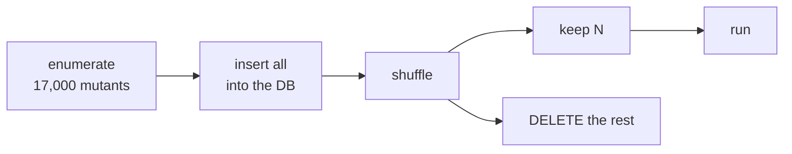

# Operators and sampling

**Abstract.** angelo's operator set was widened to match mutmut's: **63 mutants against
mutmut's 61** on the same file, up from roughly 60 percent. A bigger pool needs a way to
bound it, so `--sample N` keeps N mutants and **deletes the rest from the database**. The
score becomes an estimate over a random sample of the whole codebase.

## Operators

Every mutation is a **token level byte splice**: find a token, replace its bytes. There is
no AST rewriting, so nothing can go subtly wrong during code generation.

| Group | Mutations |
|---|---|
| Arithmetic | `+ - * / // % **` each swap for their opposite |
| Bitwise & shifts | `& \| ^ << >>` |
| Comparison | `== != < <= > >=` |
| Boolean & keywords | `and`/`or`, `True`/`False`, `break`→`return`, `continue`→`break`, `is`→`is not` |
| Augmented assignment | `+= -= *= /= //= %= **= &= \|= ^= <<= >>=` |
| Numbers | `n` → `n + 1`, in decimal, hex, octal, binary and float |
| Strings | wrap in `XX…XX`, flip to upper, flip to lower |
| Unary | drop `not`, drop `~` |
| String methods | `lower`/`upper`, `lstrip`/`rstrip`, `find`/`rfind`, `ljust`/`rjust`, `index`/`rindex`, `removeprefix`/`removesuffix`, `partition`/`rpartition`, `split`/`rsplit` |

Three rules keep the noise down:

- **Docstrings are not mutated.** Triple-quoted strings are documentation, not behaviour.
- **A method swap needs a dot.** `x.lower()` is a method call. A variable named `lower` is
  not.
- **A `for` loop's `in` is left alone.** `for x not in y` is always a syntax error, so
  mutating it would only inflate the `error` count.

Dropping `not` doubles as mutmut's `is not`→`is` and `not in`→`in` swaps, because removing
the token is the same edit.

## Result

Same file, both tools, arithmetic through string methods:

| | mutants |
|---|---|
| angelo | **63** |
| mutmut 3.6.0 | 61 |

The demo project went from 11 mutants to **74 across 3 files**.

## Not implemented

mutmut also rewrites the AST, which byte splices cannot reach:

- dropping or `None`-ing call arguments
- `dict(a=b)` → `dict(aXX=b)`
- `lambda: x` → `lambda: None`
- `a = b` → `a = None`
- dropping `case` arms from a `match`

These need a code generator. The trade is deliberate. A splice cannot produce subtly wrong
Python, only obviously broken Python, which lands in `error` and outside the score.

## Sampling



```
angelo exec --sample 500
```

**This deletes rows.** It does not run the first 500 and leave the rest pending. The
overflow leaves the database entirely, so what remains is a random sample drawn from every
file, and the score is an **estimate** over that sample rather than a complete census of
whichever files happened to be enumerated first.

angelo says so on every sampled run:

```
sampled 20 of 74 mutants, 54 dropped at random, so the score is an ESTIMATE
over a random sample, not a full census
```

Measured on the demo: sampling 20 of 74 kept 10 from `calculator.py`, 6 from `flags.py`
and 4 from `text.py`, spread across the pool roughly in proportion to each file's size.

The shuffle is a small xorshift seeded by the pool size, so **the same project samples the
same way twice** and two runs stay comparable. That is a deliberate choice for
reproducibility over unpredictability.

## Limits

- Sampling only applies to a **fresh** enumeration. Resuming keeps the existing pool;
  delete `.angelo/` to re-sample.
- A small sample is a noisy estimate. The demo scored 62.2 percent on all 74 mutants and
  70.0 percent on a sample of 20. Same code, same tests, eight points apart.
- angelo reports no confidence interval. Treat a sampled score as approximate.
