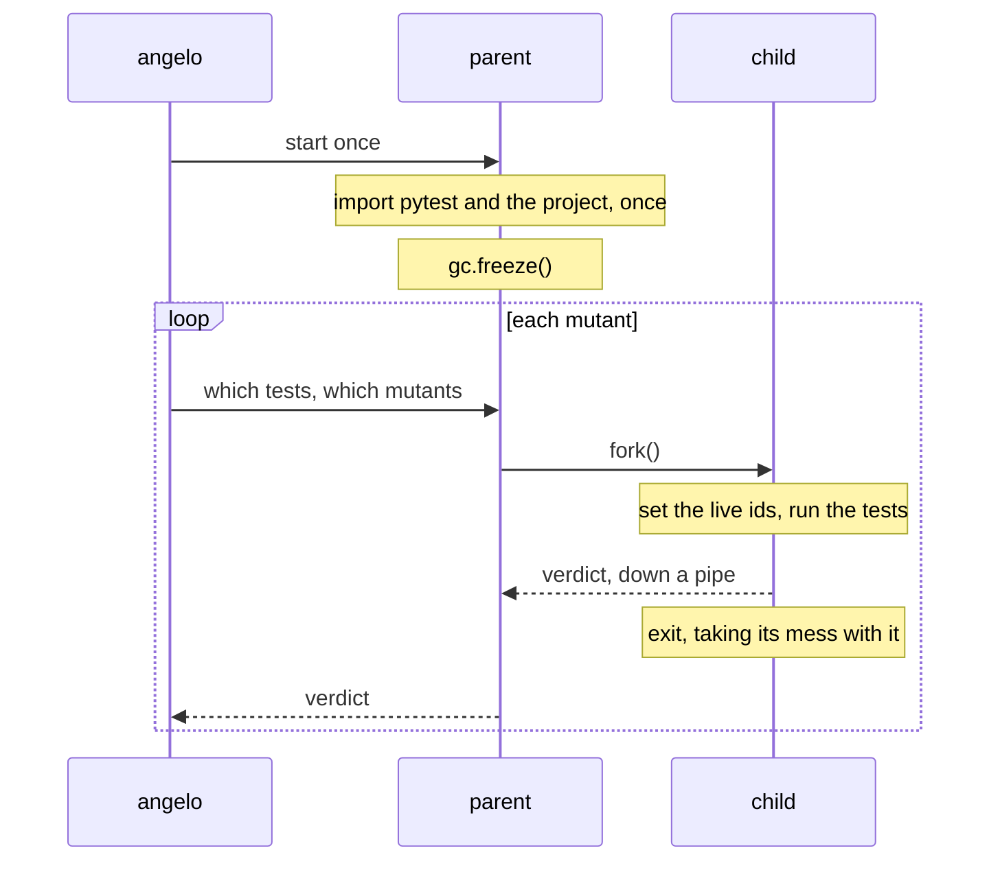

# Schemata

!!! abstract "In one sentence"
    Splicing writes one mutant into a file, so the process must re-import the project to
    see it. Schemata write **every** mutant in at once and pick one with an environment
    variable, so nothing is re-imported — but only `fork()` makes that safe, so it is a
    Unix path and Windows keeps splicing.

## The problem

[Warm workers](03-warm-workers.md) keep pytest imported and drop the project's own modules
between mutants, so the mutated source is re-imported. That re-import is the last
per-mutant cost left, and it grows with the project.

Measured in a forked child, running one test either way:

| Project | re-import per mutant | keep the imports | cost |
| --- | --- | --- | --- |
| 2 modules | — | — | 1 ms (1.05x) |
| 63 modules | 48.1 ms | 17.3 ms | **31 ms (2.76x)** |

On [`demo/`](https://github.com/kvandeh/angelo/tree/main/demo) it is worth nothing. On a
real package it is most of what a run costs.

## What mutmut does

mutmut is fast because of schemata, not because of `fork()`. It rewrites the tree once
into a `mutants/` directory, turning each function into a family, and selects one member
per run from `MUTANT_UNDER_TEST`. `fork()` is what makes reusing the process safe, since
nothing is re-imported to reset it.

Fork **without** schemata was measured first and is not worth having: it is about 2x
slower than the purge, because a child pays pytest's per-session setup that a long-lived
process amortises.

## Method

One function becomes its original, one copy per mutant, a lookup table and a wrapper.

```python
def add__angelo_orig(a, b):
    return a + b

def add__angelo_7(a, b):
    return a - b

add__angelo_mutants = {7: add__angelo_7}

def add(*args, _angelo_orig=add__angelo_orig, _angelo_mutants=add__angelo_mutants,
        _angelo_cache=[-1, None], **kwargs):
    return _angelo_pick(_angelo_orig, _angelo_mutants, _angelo_cache)(*args, **kwargs)
```

Copies are made **as text**, so a mutant anywhere inside the function comes along without
anything having to understand it: nested functions, comprehensions and all.

Three details are load-bearing:

**The original and the table are captured as default arguments.** A method's body cannot
see its own class body, so a bare name would fail at call time.

**`_angelo_cache` is a mutable default on purpose.** It is one list per function, and the
runtime resolves the live mutant into it once per batch. Without it every call of every
mutated function would scan the whole batch — a tax on the user's hot path, for the entire
run, not just for the mutant being judged.

**Decorators move to the wrapper.** `@property` and `@classmethod` have to wrap the
function the outside world calls, not a copy of it.

## What stays spliced

Schemata are all-or-nothing per batch: one spliced member needs the file written, and the
re-import with it. So batches are composed from hosted and spliced mutants **separately** —
mixed, at two mutants in three hosted, a batch of eight would be all-hosted about one time
in forty, and the feature would do nothing.

A mutant is left to the splice path when:

| Case | Why |
| --- | --- |
| Module level, class attributes | No function to copy |
| Anything that will not parse | See below |
| Function signatures | A default argument runs at import, not at call |
| `@x.setter` and friends | The decorator names the function it is rebuilding |
| Async generators | `async def` and `yield from` do not combine |
| Windows | No `fork()`, so no isolation |

**A mutant that breaks the syntax is the one that matters.** Spliced, `*args` mutated to
`/args` costs one `error` verdict and sits outside the score. Compiled into the file it
breaks every other mutant there, and the whole package with it. Found on flask, where it
turned all 221 mutants of a run into errors — which reads exactly like a broken test
command. Every generated copy is now parsed before it is accepted.

## Result

flask, 1000-mutant sample, 16 workers, one mutant per run, the same pool judged twice:

| | wall | 
| --- | --- |
| spliced | 158.4 s |
| hosted | **115.9 s** |

**42.5 s, or 27%.** The mechanism on its own is worth 115 ms per mutant it hosts — a
re-import of flask's 210 modules costs 165.9 ms and keeping them costs 50.5 ms — and 467 of
the 750 judged mutants were hosted, which predicts 54 s. The rest is the splice path's file
write and the mutants schemata cannot take.

Ten of the 1000 verdicts differ, and five of them are **schemata correcting the splice
path**: a mutant that errored spliced came back `killed` or `survived` compiled in.

!!! warning "This was invisible until test selection worked"
    The first measurement said schemata bought nothing. It was right, and it was measuring
    a broken run: coverage.py names a test context after the module's `__name__` and junit
    names it after the file's path, so on a project with no `tests/__init__.py` **no context
    resolved**, every run was a whole-suite run, and 115 ms of saved import sat under 7.8 s
    of tests nobody needed. Fixing that took the same pool from 718 s to 125 s and made this
    number visible. See [test selection](02-test-selection.md).

## Isolation

Schemata mean nothing is re-imported, so nothing resets the process between mutants
either. That makes isolation mandatory rather than nice.



`gc.freeze()` is not optional. The child inherits tens of thousands of tracked objects, and
the collector walking them dirties every copy-on-write page it touches. Without it a fork
costs more than it saves; with it the child beat an in-process run 26 ms to 40 ms.

Three things follow:

- **`warm_recycle_after` does nothing on this path.** A forking worker accumulates no
  state, so restarting it would only repay the warm-up. The worker says whether it forked
  and angelo stops counting.
- **A hung mutant no longer costs a worker.** The parent owns the deadline and kills the
  child's process group, then takes the next mutant.
- **A worker that cannot fork purges anyway**, whatever the caller asked for. That is
  slower and correct, and it is what happens if the warm-up leaves a thread behind, since
  `fork()` in a multi-threaded process is undefined.

## Limits

- **Unix only.** Windows has no `fork()`, and schemata without it would leak state between
  mutants with nothing to reset it — worse than what it replaces.
- **Introspection changes.** `inspect.signature` sees the wrapper. Async and generator
  functions get wrappers of their own shape so `iscoroutinefunction` still answers
  correctly, but an async generator is not hosted at all.
- **A mutant that raises at import time would take its whole file down.** Signatures are
  excluded for this reason; a mutant in the body cannot run until it is called.
- The generated code is never read by a human and never touches the project — it is
  written into the worker's temporary copy. `ANGELO_DUMP_SCHEMATA=<dir>` keeps a readable
  copy when it needs debugging.
