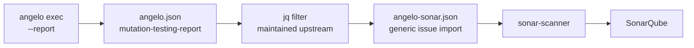

# SonarQube

**Abstract.** SonarQube is where most teams already read their code quality, and no Python
mutation testing tool puts survivors there. Angelo does, and it needed no new code to do it:
the JSON report is already the format one documented conversion away from Sonar's generic
issue import. A jq filter maintained by the Stryker project does the conversion, the scanner
does the rest. **No plugin, no Java, and it works on SonarQube Cloud.** Measured against
SonarQube 26.7 Community Build: the demo project's 28 survivors arrived as 28 issues, on the
right files, at the right columns.

## Background

Sonar offers exactly three ways in. All three were surveyed, so nobody has to survey them
again.

| Path | Mechanism | Verdict |
| --- | --- | --- |
| **Generic issue import** | `sonar.externalIssuesReportPaths` points at a JSON file of issues | **This one.** No plugin, no Java, works on Community Build and on Cloud |
| **A SonarQube plugin** | A Java plugin declaring `Metrics` and a `MeasureComputer` — the only way to get a real *metric*, with history and a quality-gate condition on the number | **Deferred.** A separate Java repository, per-version compatibility work, and third-party plugins do not run on SonarQube Cloud at all |
| **Emit Pitest `mutations.xml`** and reuse the existing Mutation Analysis plugin | — | **Dead end** |

The third one looks like a free win and is not. The plugin registers only
`JavaRulesDefinition` and `KotlinRulesDefinition`, its rules activate through Java and Kotlin
quality profiles that a Python project never has, and its parser reads `sourceFile` as a bare
Java filename plus a `mutatedClass`. **Do not spend time on it.**

One correction worth recording, because it reads the other way at a glance: what SonarQube
deprecated in 8.2 was the manual `api/custom_measures` web API, **not** the plugin `Metrics`
extension point. The plugin path is still open. It is just expensive.

## Method

Three steps, and Angelo is only the first of them.



```bash
angelo exec --report angelo.json --fail-under 60

curl -sSLO https://raw.githubusercontent.com/stryker-mutator/mutation-testing-elements/master/integrations/mutation-report-to-sonar.jq
jq -f mutation-report-to-sonar.jq angelo.json > angelo-sonar.json

sonar-scanner -Dsonar.externalIssuesReportPaths=angelo-sonar.json
```

The filter belongs to
[mutation-testing-elements](https://github.com/stryker-mutator/mutation-testing-elements/blob/master/integrations/mutation-report-to-sonar.jq)
and is maintained there. Angelo emits the schema; the conversion is somebody else's
problem on purpose.

### Two rules, not one

The filter imports **only `Survived` and `NoCoverage`**, and gives them different rule ids
and different messages.

| Rule id in Sonar | Angelo status | What the developer should do |
| --- | --- | --- |
| `external_Angelo:MutantSurvived` | `survived`, a test ran it | Add an assertion — a test executes this line and checks nothing about it |
| `external_Angelo:MutantNoCoverage` | `survived`, nothing ran it | Write a test — no test executes this line at all |

`framework.name` in the report becomes Sonar's `engineId`, which is why the rules are named
after Angelo.

### Four things that fail silently if they are wrong

The filter reads seven fields and four of them are easy to get subtly wrong. Each one is a
silent failure rather than an error, so each one is a unit test in
[`src/stryker.rs`](https://github.com/kvandeh/angelo/blob/main/src/stryker.rs).

| Requirement | Why | Failure mode |
| --- | --- | --- |
| File keys **relative and forward-slashed**, and **no `projectRoot` key at all** | The filter strips the root with a literal `sub("^" + $projectRoot + "/"; "")`. A Windows root against forward-slashed keys strips nothing | Sonar receives a path matching no file and **drops the issues with no error** |
| Locations **1-based**, `end` **exclusive**, columns in **characters** | The schema sets `minimum: 1`; the filter subtracts 1 to reach Sonar's 0-based columns | A 0-based column becomes `-1` |
| `NoCoverage` emitted separately from `Survived` | See above — different rule, different action | Two different jobs collapse into one finding |
| `error` mapped to `RuntimeError` rather than dropped | See [the caveat](#the-caveat-that-matters) | A broken test command exports as a clean bill of health |

## In CI

```yaml
- name: Mutation testing
  run: angelo exec --diff-base --report angelo.json --fail-under 60

- name: Convert for SonarQube
  if: always()
  run: |
    curl -sSLO https://raw.githubusercontent.com/stryker-mutator/mutation-testing-elements/master/integrations/mutation-report-to-sonar.jq
    jq -f mutation-report-to-sonar.jq angelo.json > angelo-sonar.json

- name: SonarQube scan
  if: always()
  uses: SonarSource/sonarqube-scan-action@v6
  env:
    SONAR_TOKEN: ${{ secrets.SONAR_TOKEN }}
  with:
    args: -Dsonar.externalIssuesReportPaths=angelo-sonar.json
```

`if: always()` is the load-bearing part. `--fail-under` exits 1 on a bad score, and the
issues are most worth uploading exactly then.

**`--diff-base` pairs naturally with this.** It scopes the run to what the branch adds, which
is the same set of lines Sonar's new code period cares about.

## Result

Verified end to end against **SonarQube 26.7.0 Community Build** on the `demo/` project, a
run of 74 mutants scoring 62.2%.

| Check | Result |
| --- | --- |
| Issues imported | **28**, matching the run's 28 survivors exactly |
| Split by rule | 19 `MutantSurvived`, 9 `MutantNoCoverage` |
| Files resolved | All three, by relative path, on Windows |
| Column accuracy | `calculator.py:51` cols 13–15 is `>=`, cols 16–19 is `100` — exact |
| Format warnings from the scanner | **None** |

That last row settles an open question. The filter writes `engineId`, `type` and `severity`
inline on each issue and emits no `rules` array, whereas the current Sonar documentation
describes a `rules` array carrying `cleanCodeAttribute` and `impacts`. **26.7 accepts the
older shape without a deprecation warning.** Should that change, writing Sonar's JSON
directly is about forty more lines in `stryker.rs` and drops the jq step entirely — but
until it warns, one maintained-upstream filter beats a second format Angelo has to keep
correct.

## The caveat that matters

**An all-`error` run exports an empty issue list, and Sonar renders that as "no problems
found."**

The filter imports survivors. A broken test command produces all `error`, which is zero
survivors, which is a green dashboard. That is this tool's characteristic failure —
inventing a test gap that does not exist — running in reverse, and it is worse, because the
warning Angelo prints about error counts never reaches Sonar.

Two things guard it, and both are needed:

1. `error` maps to `RuntimeError` and `untestable` to `Ignored`, so they are in the report
   file even though the filter drops them. The [HTML report](07-reports.md) shows them.
2. **Use `--report` alongside `--fail-under`, never instead of it.** The exit code is what
   stops a broken run. The report is only visibility.

## Limits

- **No mutation score reaches SonarQube.** The filter drops everything that is not a
  survivor, so Sonar sees issues and never a percentage. A real metric needs the plugin path,
  and that is impossible on SonarQube Cloud.
- **External issues cannot be managed in quality profiles.** They do not appear on the Rules
  page, they cannot be marked false positive in Sonar, and they cannot be filtered out of a
  generic "new issues > 0" gate. A team that wants visibility without a hard block has no
  dial.
- **jq is a real prerequisite.** It is preinstalled on GitHub-hosted runners, which is where
  this is used, but a local Windows scan needs it fetched.
- `sonar-stryker-plugin` consumes StrykerJS `event-recorder` streams rather than the JSON
  report, so it is not a shortcut either.
