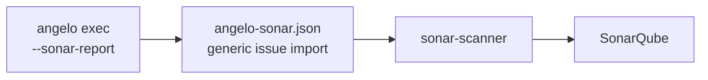

# SonarQube

**Abstract.** SonarQube is where most teams already read their code quality, and no Python
mutation testing tool puts survivors there. Angelo does. `--sonar-report` writes SonarQube's
generic issue import format directly, and `sonar.externalIssuesReportPaths` takes it from
there. **No plugin, no Java, nothing installed on the server, and it works on SonarQube
Cloud.** Measured against SonarQube 26.7 Community Build: the demo project's 28 survivors
arrived as 28 issues, on the right files, at the right columns, with no warning.

## Background

Sonar offers exactly three ways in. All three were surveyed, so nobody has to survey them
again.

| Path | Mechanism | Verdict |
| --- | --- | --- |
| **Generic issue import** | `sonar.externalIssuesReportPaths` points at a JSON file of issues | **This one.** No plugin, no Java, works on Community Build and on Cloud |
| **A SonarQube plugin** | A Java plugin declaring `Metrics` — the only way to get a real *metric*, with history and a quality-gate condition on the number | **Built**, and it lives in `integrations/sonarqube/`. Self-hosted only: third-party plugins do not run on SonarQube Cloud at all. See [the plugin](10-sonar-plugin.md) |
| **Emit Pitest `mutations.xml`** and reuse the existing Mutation Analysis plugin | — | **Dead end** |

The third one looks like a free win and is not. The plugin registers only
`JavaRulesDefinition` and `KotlinRulesDefinition`, its rules activate through Java and Kotlin
quality profiles that a Python project never has, and its parser reads `sourceFile` as a bare
Java filename plus a `mutatedClass`. **Do not spend time on it.**

One correction worth recording, because it reads the other way at a glance: what SonarQube
deprecated in 8.2 was the manual `api/custom_measures` web API, **not** the plugin `Metrics`
extension point. The plugin path is still open. It is just expensive.

## Method

Two steps. Angelo writes the file Sonar reads.



```bash
angelo exec --sonar-report angelo-sonar.json --fail-under 60

sonar-scanner -Dsonar.externalIssuesReportPaths=angelo-sonar.json
```

**Nothing is installed on the SonarQube server.** Sonar registers Angelo's two rules as
*external* rules from that file alone. That is also why they never appear on the Rules page
or in a quality profile — see [limits](#limits).

### The route this replaces

The original design went through Stryker's own jq filter, which converts the
`--report` schema into this same format:

```bash
angelo exec --report angelo.json
curl -sSLO https://raw.githubusercontent.com/stryker-mutator/mutation-testing-elements/master/integrations/mutation-report-to-sonar.jq
jq -f mutation-report-to-sonar.jq angelo.json > angelo-sonar.json
```

It works, and reusing a converter somebody else maintains was the better trade right up until
it was measured. **SonarQube 26.7 imports the filter's output and warns while doing it:**

```
WARN External issues were imported with a deprecated format which will be
removed in a later version of SonarQube. The "rules" field is missing.
```

The filter writes `engineId`, `type` and `severity` inline on each issue and emits no `rules`
array. That is the pre-10.x shape, and Sonar has announced its removal. `--sonar-report`
writes the current one — a `rules` array declaring `cleanCodeAttribute` and `impacts` — which
drops the deprecation and the jq dependency together.

The jq route stays documented because it still works today and because it is what a project
already emitting `--report` for Stryker's viewer will reach for. Prefer `--sonar-report`.

### Two rules, not one

Only survivors become issues, and the two kinds are **not** the same finding.

| Rule id in Sonar | Angelo status | What the developer should do |
| --- | --- | --- |
| `external_Angelo:MutantSurvived` | `survived`, a test ran it | Add an assertion — a test executes this line and checks nothing about it |
| `external_Angelo:MutantNoCoverage` | `survived`, nothing ran it | Write a test — no test executes this line at all |

Both are declared with the clean-code attribute **`TESTED`**, which is Sonar's own vocabulary
for exactly this, and a `MAINTAINABILITY` impact — `MEDIUM` for a survivor, `HIGH` for an
uncovered one. `engineId` is `Angelo`, which is where the `external_Angelo:` prefix comes
from.

Everything else stays out. `killed` is the suite working; `error` and `untestable` are Angelo
reporting on itself, and a splice that broke the syntax is not a smell in somebody's file.
**That is precisely why a build is gated on `--fail-under` and never on this** — see
[the caveat](#the-caveat-that-matters).

### Four things that fail silently if they are wrong

Four fields are easy to get subtly wrong, and each one fails *silently* rather than erroring.
Each is therefore a unit test in
[`src/sonar.rs`](https://github.com/kvandeh/angelo/blob/main/Angelo/src/sonar.rs), and the same four
in [`src/stryker.rs`](https://github.com/kvandeh/angelo/blob/main/Angelo/src/stryker.rs) for the jq
route.

| Requirement | Why | Failure mode |
| --- | --- | --- |
| Paths **relative and forward-slashed** | Sonar resolves `filePath` against the scanner's base directory by literal match | A Windows separator matches no file and Sonar **drops the issue with no error** |
| Columns **0-based** for Sonar, 1-based in the schema | The two formats disagree, so every column loses one on the way out | The squiggle lands on the wrong token |
| `NoCoverage` separated from `Survived` | Different rule, different action | "write a test" and "add an assertion" collapse into one finding |
| A `rules` array with `cleanCodeAttribute` and `impacts` | The pre-10.x inline `type`/`severity` pair is deprecated | The import warns, and a later SonarQube will reject it |

## In CI

```yaml
- name: Mutation testing
  run: angelo exec --diff-base --sonar-report angelo-sonar.json --fail-under 60

- name: SonarQube scan
  if: always()
  uses: SonarSource/sonarqube-scan-action@v6
  env:
    SONAR_TOKEN: ${{ secrets.SONAR_TOKEN }}
  with:
    args: -Dsonar.externalIssuesReportPaths=angelo-sonar.json
```

`if: always()` is the load-bearing part. `--fail-under` exits 1 on a bad score, and the
issues are most worth uploading exactly then.

**`--diff-base` pairs naturally with this.** It scopes the run to what the branch adds, which
is the same set of lines Sonar's new code period cares about.

## Configuration

The flag can live in `angelo.conf` instead, and the flag wins.

```toml
sonar_report = "angelo-sonar.json"   # empty means off, which is the default
```

## Result

Verified end to end against **SonarQube 26.7.0 Community Build** on the `demo/` project, a
run of 74 mutants scoring 62.2%, scanned from a Windows host.

| Check | jq route | `--sonar-report` |
| --- | --- | --- |
| Issues imported | 28, matching the run's 28 survivors | **28** |
| Split by rule | 19 `MutantSurvived`, 9 `MutantNoCoverage` | **Same** |
| Files resolved | All three, by relative path | **All three** |
| Column accuracy | `calculator.py:51` cols 13–15 is `>=`, cols 16–19 is `100` | **Identical** |
| Scanner format warning | **Deprecated format, `rules` field missing** | **None** |

The two routes agree issue for issue, which is the point: `--sonar-report` is the same
findings in the shape Sonar is not planning to remove.

One measurement worth recording next to it. The same scan imported a coverage report:

| Metric | Value |
| --- | --- |
| Line coverage | 89.6% |
| Mutation score | 62.2% |

**That gap is the entire argument for the tool.** Coverage says the line ran. The mutation
score says its behaviour was actually asserted on.

## The caveat that matters

**An all-`error` run exports an empty issue list, and Sonar renders that as "no problems
found."**

Only survivors become issues. A broken test command produces all `error`, which is zero
survivors, which is a green dashboard. That is this tool's characteristic failure —
inventing a test gap that does not exist — running in reverse, and it is worse, because the
warning Angelo prints about error counts never reaches Sonar.

Two things guard it, and both are needed:

1. **Use `--sonar-report` alongside `--fail-under`, never instead of it.** The exit code is
   what stops a broken run. The report is only visibility.
2. Keep `--html-report` or `--report` for the full picture. Sonar sees survivors; those two
   show `error` and `untestable` counts, and the [HTML report](07-reports.md) puts them above
   the score where they cannot be missed.

## Limits

- **No mutation score reaches SonarQube through this route.** Generic import creates
  *issues*, and a percentage would be a *measure*. There is no import path for measures —
  `api/custom_measures` was removed in 8.2 — so the score needs
  [the plugin](10-sonar-plugin.md), which is self-hosted only. On Cloud the score stays in
  the terminal, the exit code and the HTML report.
- **External issues cannot be managed in quality profiles.** They do not appear on the Rules
  page, they cannot be marked false positive in Sonar, and they cannot be filtered out of a
  generic "new issues > 0" gate. A team that wants visibility without a hard block has no
  dial.
- **The jq route needs jq.** It is preinstalled on GitHub-hosted runners, but a local Windows
  scan has to fetch it. `--sonar-report` needs nothing but Angelo.
- **Coverage is a separate import.** SonarQube runs nothing itself, so line coverage stays 0%
  until `sonar.python.coverage.reportPaths` is pointed at a `coverage.xml`. `sonar.tests` only
  classifies files as test code; it imports no coverage at all.
- `sonar-stryker-plugin` consumes StrykerJS `event-recorder` streams rather than the JSON
  report, so it is not a shortcut either.
