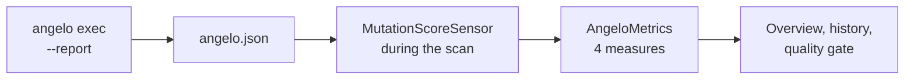

# The SonarQube plugin

**Abstract.** [`--sonar-report`](09-sonarqube.md) puts survivors on a SonarQube dashboard as
issues, and stops there, because generic import creates issues and a percentage is a measure.
This plugin is the other half: a jar that declares **Mutation Score** as a real SonarQube
metric, with history and a quality-gate condition on the number. It is roughly 280 lines of
Java, it installs nothing into Angelo, and it **cannot run on SonarQube Cloud**.

## Background

SonarQube separates two things that look alike on a dashboard.

| | Created by | Angelo reaches it via |
| --- | --- | --- |
| An **issue** | Generic import, SARIF, or an analyzer | `--sonar-report`, no plugin |
| A **measure** | An analyzer declaring `Metrics` — that is, a plugin | This jar |

There is no import path for measures. `api/custom_measures` was the one and it was **removed
in 8.2**; every remaining `api/measures/*` and `api/metrics/*` endpoint is read-only. So a
mutation score on the dashboard needs a plugin or it does not happen.

What SonarQube deprecated in 8.2 was that web API, **not** the plugin `Metrics` extension
point. That distinction is the whole reason this page exists.

## Method

Three extension points, and nothing clever.



| Class | Does |
| --- | --- |
| `AngeloPlugin` | Registers the other two |
| `AngeloMetrics` | Declares the four metrics in a **Mutation Testing** domain |
| `MutationScoreSensor` | Reads `angelo.json` during the scan and saves the measures |

The sensor reads the **mutation-testing-report schema** that `--report` already writes — the
cross-language one StrykerJS and Stryker.NET also emit — so it is not Angelo-specific by
accident of format. It applies the schema's own arithmetic, `detected / valid`, which is
`Summary::score` character for character. **Nothing recomputes a number it could disagree
with.**

### The metrics

| Key | Shown as | Holds |
| --- | --- | --- |
| `angelo_mutation_score` | Mutation Score | `detected / valid` as a percentage |
| `angelo_mutants_valid` | Mutants Scored | The denominator, so the score is never read without its sample size |
| `angelo_mutants_survived` | Mutants Survived | Faults no test noticed |
| `angelo_mutants_errored` | Mutants Errored | Mutants no run could judge |

**`angelo_mutants_errored` is published on purpose.** A run where everything errored has no
score at all, and publishing 0% would read as a catastrophic suite rather than as a broken
test command. The sensor publishes no score in that case and says so in the scan log, which
is why the count has to sit beside it.

## Install it

The jar is attached to its own GitHub release, tagged apart from Angelo's binary because it
versions on SonarQube's API rather than on Angelo's features.

```bash
# Download sonar-angelo-plugin-<version>.jar from the releases page, then:
docker cp sonar-angelo-plugin-0.1.0.jar sonarqube:/opt/sonarqube/extensions/plugins/
docker restart sonarqube
```

For a non-container server, drop it in `extensions/plugins/` and restart. Confirm it loaded:

```bash
curl -s -u admin:admin http://localhost:9000/api/plugins/installed | grep angelo
```

Then point the sensor at a report and scan as usual:

```bash
angelo exec --report angelo.json --sonar-report angelo-sonar.json
sonar-scanner -Dsonar.externalIssuesReportPaths=angelo-sonar.json
```

`sonar.angelo.reportPath` overrides where the sensor looks; it defaults to `angelo.json`
relative to the scanner's base directory. A missing file is logged and skipped, never an
error — the mutation score is extra information, not the reason anybody ran the scanner.

## Gate on it

**Quality Gates → your gate → Add condition → Mutation Score → is less than → 80.** Then
assign the gate under **Project Settings → Quality Gate**. A failing gate shows on the
project overview and fails the scanner step in CI.

## Result

Verified against **SonarQube 26.7.0 Community Build**, scanning the `demo/` project from a
Windows host.

| Check | Result |
| --- | --- |
| Plugin loads | Yes, `"key":"angelo"` in `api/plugins/installed` |
| Score published | **62.16%**, matching Angelo's terminal output exactly |
| Counts published | 74 scored, 28 survived, 0 errored |
| Quality gate condition | `angelo_mutation_score < 80` accepted, evaluated **ERROR** |
| Line coverage | 89.6%, untouched |

The build workflow re-runs the load check on every push: it starts a real SonarQube with the
freshly built jar and fails if `api/plugins/installed` does not name it. **A plugin that
compiles and does not load is the characteristic failure here**, and `mvn package` cannot see
it — the API version, the manifest entries and the bytecode level are all checked by the
server at startup and by nothing before it.

## Limits

- **SonarQube Cloud runs no third-party plugins.** Not a configuration problem and not
  something a future version of this jar fixes. Cloud users get `--sonar-report` and no
  score. This is the single most important thing on the page.
- **The gate is Overall Code only.** New-code conditions need a separate `new_`-prefixed
  metric computed over the new code period by a `MeasureComputer`, and this jar declares
  none, so *"new code must score 80%"* is not available. Whole-project mutation score barely
  moves on a large repository, which makes it a weak gate — this is the most valuable thing
  left to build, and it pairs with `angelo exec --diff-base`.
- **The score is per project, not per file.** The sensor saves on the project, so no file in
  the tree carries its own mutation score. The [HTML report](07-reports.md) ranks files
  worst-first if that is what you need.
- **It is not on the Marketplace.** Listing needs a SonarSource review, so installation is a
  manual jar drop.
- **Compiled against `sonar-plugin-api` 10.11, tested on 26.7 Community Build.** Older
  servers are untested rather than known-broken.
