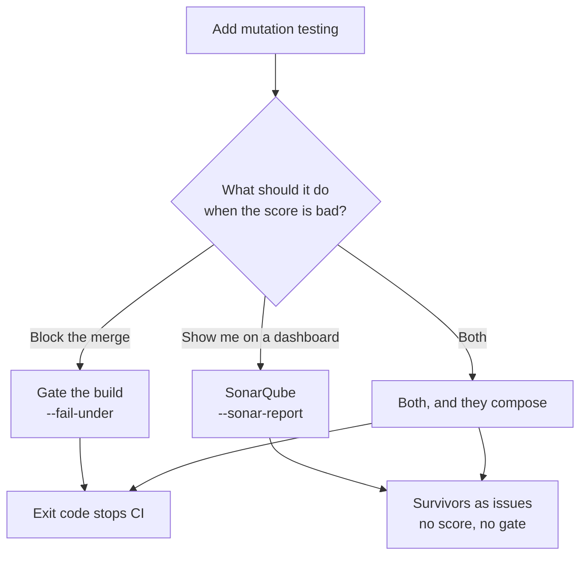

# Setting it up with an AI agent

Most teams will not wire Angelo in by hand. They will ask an agent — Claude Code, Copilot,
Cursor, or whatever their company runs internally — to *"add mutation testing to CI"*, and
the agent will produce a workflow file in about a minute.

That workflow is usually **green and meaningless**. Angelo's characteristic failure is
inventing a test gap that does not exist, and an agent that skips four setup facts produces
exactly that: a pipeline that runs, prints a score, blocks nothing, and measures nothing.

This page is the missing context. It is written to be **pasted into an agent**, not read for
pleasure. If you are a person doing this by hand, [Integrations](integrations.md) is the
shorter road.

## Ask one question before writing anything

Angelo produces two different setups and they are not substitutes. An agent that guesses gets
it wrong half the time, so **ask**.



| The user wants | Route | Gives them |
| --- | --- | --- |
| A merge blocked on a bad score | `--fail-under` | An exit code. The only thing that actually stops a bad change |
| Survivors visible where they already read code quality | `--sonar-report` | Issues on the right files and lines. **No score, no history, no gate** |
| Both | Both flags on one run | One run, two outputs. This is the common answer |

!!! warning "Never offer the dashboard as a substitute for the gate"
    Only survivors become Sonar issues. A run where every mutant `error`s uploads **nothing**,
    and Sonar renders nothing as a clean bill of health. `--fail-under` is what catches that.
    If a user asks for SonarQube only, set up both and tell them why.

**If the request does not say which, ask the user.** It is one question and it changes the
whole deliverable.

## Paste this into the agent: a CI gate

````markdown
Set up Angelo mutation testing in CI for this repository.

Angelo is a Rust binary that drives an ordinary pytest suite. It plants faults and
reports which ones the tests fail to catch. Docs: https://angelo.kcvdh.com/

Work through these in order. Do not skip the inspection step — the failure mode of a
careless setup is a pipeline that passes while measuring nothing.

1. INSPECT THE PROJECT FIRST
   - Find the pytest config: `[tool.pytest.ini_options]` in pyproject.toml, or
     pytest.ini, tox.ini, setup.cfg.
   - Read its `addopts`. If it names a pytest plugin — `--cov`, `-n`, `-p xdist`, or any
     other — you MUST handle it in step 3 or the run silently scores 0%.
   - Find the source directory (the package being tested), not the tests directory.
   - Check whether the suite is currently green.

2. INSTALL, IN THE SAME JOB AS THE SUITE
   - The project's own test dependencies, exactly as the existing test job installs them.
   - `pip install coverage` — near-mandatory. Without it Angelo runs one mutant per
     pytest run (about 8x slower) and cannot route around a red suite.
   - `pip install --index-url https://test.pypi.org/simple/ angelo` — pin the version.
     Real PyPI is still to come. That index flag REPLACES PyPI, so give Angelo its own
     pip command, or add `--extra-index-url https://pypi.org/simple/` to keep PyPI in
     the search.

3. WRITE angelo.conf AT THE REPOSITORY ROOT AND COMMIT IT
   ```toml
   paths = ["src"]                    # the package, never "." and never the tests
   test_command = "python -m pytest"  # must stay this shape, see below
   fail_under = 0                     # leave 0 here; pass the threshold as a flag
   exclude = ["**/migrations/**"]     # generated and vendored code
   ```
   - `test_command` MUST match `<something containing python> -m pytest`. A bare
     `pytest`, `uv run pytest`, `poetry run pytest`, `tox` or `make test` disables
     coverage, batching, test selection and warm workers all at once. Point it at an
     interpreter instead, with an ABSOLUTE path if it is not the one on PATH.
   - If the project's `addopts` loads a plugin, add `warm_workers = false` and put the
     neutralising flags in `test_command` (see the traps table on this page). Do not
     add extra pytest flags while `warm_workers` is true — they are dropped.
   - Do NOT run `angelo init` in CI. It exits 1 when angelo.conf already exists, and
     `angelo exec` writes one itself when it is missing.

4. ADD THE WORKFLOW STEP
   - Scope it to the pull request with `--diff-base`, and set `fetch-depth: 0` on the
     checkout. A shallow clone has no merge base and Angelo will stop rather than guess.
   - Gate with `--fail-under`. Start at a threshold the project ALREADY clears — run it
     once, read the score, set the number just under it. Do not invent 80.
   - Write `--html-report` and upload it with `if: always()`. The report matters most on
     the run that failed.

5. VERIFY BEFORE HANDING IT OVER
   Run it locally or on a branch and check the output against the "Verify" section of
   https://angelo.kcvdh.com/ai-setup/. A score of 0.0% or 100% is a broken setup, not a
   result. Report the actual score you saw. Do not claim it works if you did not run it.
````

The workflow that instruction should produce:

```yaml
name: Mutation testing
on: pull_request

jobs:
  mutants:
    runs-on: ubuntu-latest
    steps:
      - uses: actions/checkout@v4
        with:
          fetch-depth: 0        # --diff-base needs a merge base

      - uses: actions/setup-python@v5
        with:
          python-version: "3.13"

      - name: Install the suite, coverage and Angelo
        run: |
          pip install -e ".[test]"
          pip install coverage
          pip install --index-url https://test.pypi.org/simple/ "angelo==0.2.2"

      - name: Mutate what this branch adds
        run: angelo exec --diff-base --fail-under 70 --html-report angelo.html

      - name: Keep the report either way
        if: always()
        uses: actions/upload-artifact@v4
        with:
          name: mutation-report
          path: angelo.html
```

## Paste this into the agent: SonarQube as well

Add this to the instruction above rather than replacing it. The two compose into one run.

````markdown
Also publish the survivors to SonarQube.

- Add `--sonar-report angelo-sonar.json` to the same `angelo exec` command that already
  carries `--fail-under`. One run writes both.
- Point the scanner at it: `-Dsonar.externalIssuesReportPaths=angelo-sonar.json`.
- Run the scan step with `if: always()`, because the issues are most worth uploading on
  the run the gate failed.
- Install NOTHING on the SonarQube server. Angelo writes Sonar's generic issue import
  format and Sonar registers the two rules as external rules from the file alone. This
  works on SonarQube Cloud, Server and Community Build.
- Run the scanner from the repository root, the same directory Angelo ran in. Sonar
  resolves `filePath` by literal string match against the scanner's base directory, and
  a path that does not match is dropped WITH NO ERROR.
- Tell the user two things plainly:
    1. No mutation SCORE reaches SonarQube this way. Generic import creates issues; a
       percentage is a measure, and there is no import path for measures. The score
       lives in the exit code and the HTML report.
    2. Getting the score into Sonar as a real metric needs a Java plugin on a
       self-hosted server, and third-party plugins do not run on SonarQube Cloud at
       all. If the user is on Cloud, do not offer it.
- Do not build a converter. Do not fetch Stryker's jq filter. `--sonar-report` writes the
  current format directly; the jq route emits a shape SonarQube has deprecated and warns
  about mid-scan.
````

```yaml
      - name: Mutate what this branch adds
        run: angelo exec --diff-base --fail-under 70 --sonar-report angelo-sonar.json

      - name: SonarQube scan
        if: always()
        uses: SonarSource/sonarqube-scan-action@v6
        env:
          SONAR_TOKEN: ${{ secrets.SONAR_TOKEN }}
        with:
          args: -Dsonar.externalIssuesReportPaths=angelo-sonar.json
```

## For a company's own assistant

An internal assistant answers the same question a hundred times, so the facts belong in its
rules file — `AGENTS.md`, `CLAUDE.md`, a system prompt, a retrieval corpus, whatever the
platform calls it. This block is sized to drop in whole.

````markdown
## Angelo (mutation testing)

Angelo measures test QUALITY, not coverage. Coverage says a line ran; a mutation score
says its behaviour was actually asserted on. A normal score is 50-80%. A score of 100%
means too few mutants, and 0% means a broken setup.

When asked to add, change or debug Angelo:

- Ask whether they want a build gate (`--fail-under`), a SonarQube dashboard
  (`--sonar-report`), or both. Do not guess. Recommend both, and explain that only the
  exit code can block a merge.
- Never raise `--fail-under` above the score the project currently earns. A gate that
  fails on day one gets deleted on day two.
- Never present a score without its `error` count. An all-`error` run means the test
  command is broken, not that the code is untestable.
- `--diff-base` for a pull request, `--diff` for local editing. They are not
  interchangeable: `--diff` compares against the working tree, and a pushed branch has
  no uncommitted changes, so in CI it finds nothing.
- The pool is fixed at enumeration. Changing `paths`, `exclude` or `--diff` does nothing
  until `.angelo/` is deleted.
- `--sample N` DELETES the surplus mutants and reseeds from the clock, so two sampled
  runs are not comparable. Never use it in a gate.
- Angelo runs natively on Windows. Do not suggest WSL, and do not suggest mutmut as an
  alternative on Windows — it needs fork().
- Do not add a mutation testing job to a repository whose suite is not already green in
  CI. Fix the suite first.
````

## The checklist an agent works through

| Check | Why it matters | If it is wrong |
| --- | --- | --- |
| `python` and `pytest` on PATH | Angelo drives the real suite | Nothing runs |
| `coverage` installed | Unlocks batching and test selection | ~8x slower, and a red suite stops the run |
| `test_command` is `python -m pytest` shaped | Coverage wrapping, warm workers and selection all pattern-match it | Every speed feature silently switches off |
| No plugin flags in the pytest `addopts` | Angelo does not neutralise them | **0.0% score, every mutant a false survivor** |
| `paths` names the package | The default is `.` when there is no `src/` | Docs, scripts and examples get mutated |
| `fetch-depth: 0` on the checkout | `--diff-base` needs a merge base | The run stops and says so |
| A green suite in CI, not just locally | A red baseline needs coverage to route around | Mutants come back `untestable` |
| `angelo.conf` committed, `angelo init` not in the job | `init` exits 1 when the file exists | The job fails on a file that is already correct |

## Six ways the setup fails quietly

Ranked by how hard they are to notice. The first two are the dangerous ones, because they
**inflate** the score, and a flattering number is the one nobody investigates.

| Symptom | Cause | Fix |
| --- | --- | --- |
| Score much **higher** than expected, most verdicts `timeout` | A pytest plugin from `addopts` is running inside the warm worker and hanging it. Timeouts count as detected | `warm_workers = false` in angelo.conf, plus the neutralising flag below |
| Score is **100%** on a suite you do not trust | The baseline exits 1 for a reason that is not a test failure — a pytest-cov `--cov-fail-under` threshold, or a plugin that crashes on import. Every mutant run then exits 1, and exit 1 means killed | Run the test command by hand. It must exit 0 |
| Score is **0.0%**, every mutant "survived without a single run" | pytest-cov (`--cov` in addopts) or pytest-xdist (`-n auto`) took over the coverage run, so the per-test map matched no mutant. Angelo warns, at `warn` level | Neutralise the plugin in `test_command`, see below |
| Every mutant is `error` | The test command cannot run in the pipeline. Usually a missing dependency or plugin | Run the test command by hand in the job |
| The run is slow and the log says nothing about batches | `coverage` is not installed, or `test_command` is not `python -m pytest` shaped | Install coverage; fix the command |
| A new `exclude` or `--diff` changes nothing | The pool was fixed at enumeration | Delete `.angelo/` |

### Neutralising a plugin in `addopts`

Measured on the demo project, which scores **62.2%** when it is set up correctly.

| The project's pytest `addopts` | What Angelo scored | With the fix |
| --- | --- | --- |
| `--cov=. --cov-report=term-missing` (pytest-cov) | **0.0%**, 74 false survivors, exit 0 | `test_command = "python -m pytest --no-cov"` |
| `-n auto` (pytest-xdist) | **0.0%**, 74 false survivors, exit 0 | `test_command = "python -m pytest -o addopts="` |

!!! danger "Extra pytest arguments need `warm_workers = false` today"
    The warm worker starts its own pytest with a fixed argument list, so **anything you
    add to `test_command` past `python -m pytest` is honoured by the baseline and dropped
    by the mutant runs.** The two then disagree. On the pytest-xdist case above that
    produced a run of 65 timeouts and an inflated **87.8%**, against 62.2% with warm
    workers off.

    So: if `test_command` carries any extra argument, set `warm_workers = false` in the
    same config. The run is slower and the verdicts are right, which is the correct trade
    every time.

## Verify before handing it over

An agent must run this once and read the output. Four lines decide whether the setup works.

```bash
angelo exec --verbosity info
```

| Look for | Good | Bad |
| --- | --- | --- |
| `baseline green in Ns` | Green, and a duration that resembles the real suite | `RED`, or a duration far too short |
| `N mutants sit on lines no test executes` | A small fraction of the pool | **All of them.** The coverage map matched nothing |
| `running N batches on M workers, covering tests only` | Present, and N is well under the mutant count | Absent — coverage or `test_command` is wrong |
| The score | Between roughly 40% and 90% | **0.0%** or **100.0%**, or an `error` count near the pool size |
| Any `WARN` line | None | Read every one. They are the setup telling you it is broken |

A run of the demo project that is set up correctly ends like this:

```
=== mutation report ===
    killed: 46
  survived: 28
     score: 62.2% (46/74 detected)
```

**Report the number you actually saw.** An agent that says "mutation testing is now wired up"
without a score in the message has not finished the job.

## What an agent must not do

- **Do not set a threshold the project does not already clear.** Run it, read the score, set
  the gate under it. A gate that fails on the first pull request gets removed.
- **Do not use `--sample` in a gate.** The sample is redrawn from the clock every run, so the
  threshold measures a different corner of the codebase each time.
- **Do not add mutation testing to a red pipeline.** Fix the suite first.
- **Do not run it on every push to start with.** Mutation testing is minutes, not seconds.
  `on: pull_request` with `--diff-base` is the shape that stays affordable.
- **Do not report success without a score.** A pipeline that runs is not a pipeline that
  measures.
