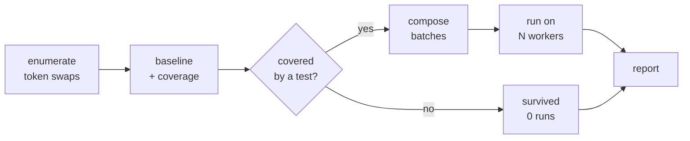

# angelo — technical notes

Each note is a short paper: **abstract, background, method, result, limits.** Read the
abstract; skip the rest until you need it.

| # | Note | One line |
|---|------|----------|
| 01 | [Batch mutating](01-batch-mutating.md) | Several mutants per test run, without losing verdicts |
| 02 | [Test selection](02-test-selection.md) | Run only the tests that can kill a mutant |
| 03 | [Warm workers](03-warm-workers.md) | A `fork()` substitute for Windows |
| 04 | [Architecture](04-architecture.md) | What each module owns |
| 05 | [Benchmarks](05-benchmarks.md) | Measured numbers, and what they do not prove |
| 06 | [Operators and sampling](06-operators-and-sampling.md) | What gets mutated, and how to cap the pool |

## The claim everything rests on

Batching, selection and warm workers are **speed features only**. Every configuration must
produce the same score on the same project.

`scripts/verdict-matrix.sh` runs 8 configurations and fails if any disagrees. It runs in
CI on every push. A speedup that changes a verdict is a bug, not a tuning result.

## The pipeline

## Vocabulary

**Mutant** — one small change to the source. **Killed** — a test failed, so your suite
caught it. **Survived** — everything passed, so your suite missed a real bug.
**Score** — killed / (killed + survived).

**Mutation conflict** — the same test case executes two mutants. They cannot share a run,
because a failure would not say which one caused it.

**Batch** — mutants that share no test, judged by one run.
