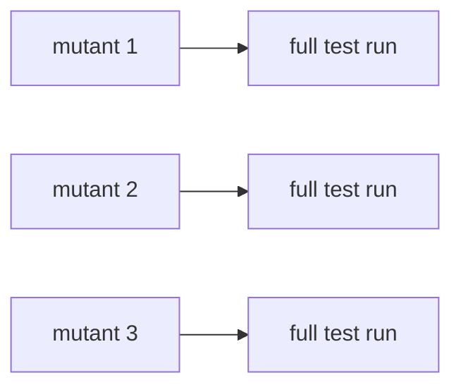
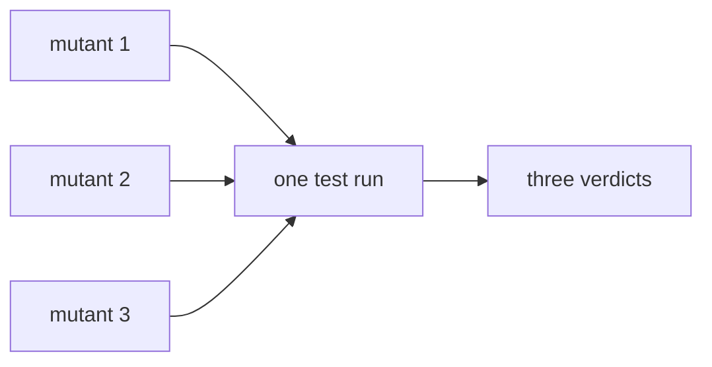

# Angelo

> Python mutation testing is slow and expensive, but what if it wasn't?

Angelo measures how good your tests actually are. It breaks your code on purpose, one
small change at a time, and checks whether your test suite notices. It is a single Rust
binary that drives your ordinary pytest suite.

On a project with 200 planted faults and a two second suite, Angelo takes **4.5 seconds**
where the standard approach takes **48 seconds**. The score is identical.

[Run it on your machine](quick-start.md){ .md-button .md-button--primary }
[Wire it into something else](integrations.md){ .md-button }

Two commands and an existing pytest suite. Nothing to configure to get started, and
[every number on this site is measured](05-benchmarks.md).

| You came here to | Go to |
| --- | --- |
| Run Angelo on a project you have open | [Run it locally](quick-start.md) |
| Gate a pull request, or put a score in CI | [Integrations](integrations.md) |
| Get survivors onto a SonarQube dashboard | [Integrations](integrations.md#sonarqube) |
| Check whether the speed claims hold | [Benchmarks](05-benchmarks.md) |
| Understand mutation testing first | Keep reading |

## What mutation testing measures

Test coverage tells you a line ran. It does not tell you whether anything checked the
result. A test suite can execute every line of a function and still pass when that
function is wrong.

Mutation testing answers the harder question. Change the code so it is definitely broken,
then run the tests:

| Term | Meaning |
| --- | --- |
| **Mutant** | One deliberate small change, such as `+` becoming `-` |
| **Killed** | A test failed. Your suite caught the bug. Good. |
| **Survived** | Every test passed. Your suite missed a real bug. |
| **Score** | killed / (killed + survived) |

A survivor is the useful output. It points at a line where you can break the behaviour
and nobody complains.

```python
def is_adult(age):
    return age >= 18
```

Change `>=` to `>` and the function now rejects eighteen year olds. If your tests still
pass, you never tested the boundary. Angelo tells you that.

## Why it is normally slow

The standard approach runs the whole test suite once per mutant. Five hundred mutants
means five hundred runs. Worse, most of each run is not testing at all. Measured on a
selected single test:

| Step | Time |
| --- | --- |
| Start the interpreter | 18 ms |
| Import pytest | 155 ms |
| Collect and configure | 139 ms |
| Run the actual test | 15 ms |

Roughly 95 percent of the work is setup. That is the problem Angelo attacks.

## How Angelo is fast

Four techniques, each measured, each documented in its own note.

| Technique | Idea | Speedup |
| --- | --- | --- |
| [Batch mutating](01-batch-mutating.md) | Test several mutants in one run | 4.6x |
| [Test selection](02-test-selection.md) | Run only the tests that touch the mutant | 2.8x |
| [Warm workers](03-warm-workers.md) | Keep one pytest process alive | 2.5x |
| [A smaller pool](06-operators-and-sampling.md) | Plant only what the evidence supports, and only where it pays | varies |

A fifth is not a technique so much as a scope: `--diff` and `--diff-base` mutate only the
lines a change touched. [Run it locally](quick-start.md#make-it-faster-or-smaller) has
both.

!!! warning "Those figures are an upper bound"
    They come from a synthetic project with independent functions and no timeouts, which
    is the best case for all three. Measured against the real click codebase, where about
    seven percent of mutants hang until the timeout, the same techniques bought
    [almost nothing](05-benchmarks.md#a-real-codebase-where-the-numbers-do-not-hold).
    Waiting for timeouts dominates whatever they save.

### Batching in one picture

Batching is the central idea, so it is worth understanding before anything else.

Normally each mutant gets its own run:



Angelo puts several mutants into the same run:



The catch is obvious. If the run fails, which mutant caused it? Angelo solves this by
only grouping mutants that **no single test can reach at the same time**. It learns which
test touches which line from one coverage run, before any mutating starts. Two mutants
that share a test are kept apart. A failing test therefore points at exactly one mutant.

[Read the full argument](01-batch-mutating.md), including what happens when a result
cannot be explained.

## The rule that governs everything

Batching, test selection and warm workers are **speed features only**. None of them is
allowed to change a verdict.

This is enforced, not promised. `scripts/verdict-matrix.sh` runs eight configurations
against the same project and fails the build if any of them disagrees about the score. It
runs in continuous integration on every push. A speedup that changes a result is treated
as a bug.

## Where to go next

- **New here?** [Run it locally](quick-start.md) installs Angelo and reads your first
  report.
- **Automating it?** [Integrations](integrations.md) covers CI, pull requests, SonarQube
  and PyPI.
- **Want the evidence?** [Benchmarks](05-benchmarks.md) has every measurement, including
  the ones that did not work out.
- **Curious how it is built?** [Architecture](04-architecture.md).
- **Want to help?** [Support](support.md), or read
  [CONTRIBUTING.md](https://github.com/kvandeh/angelo/blob/main/CONTRIBUTING.md) in the
  repository.

---

Point Angelo at a project you already have and see what your tests are missing.

[Run it on your machine](quick-start.md){ .md-button .md-button--primary }
